# ERD #1: Assignment Core Model

**Purpose**: Central assignment lifecycle and master data showing how assignments relate to locations, users, teams, templates, and classifications.

**Domain**: Core Business Entities

**Last Updated**: November 18, 2025

---

## Entity Relationship Diagram

```mermaid
erDiagram
    Assignments ||--o| Dim_AssignmentPoints : "assigned_to"
    Assignments ||--o| Dim_Assignment_Status : "has_status"
    Assignments ||--o| Dim_Assignment_Categories : "belongs_to_category"
    Assignments ||--o| Dim_WorkTemplates : "based_on_template"
    Assignments ||--o| Dim_Teams : "assigned_to_team"
    Assignments ||--o| Dim_Users_AssignedTo : "assigned_to_user"
    Assignments ||--o| Dim_Users_AssignedTo : "created_by_INACTIVE"
    Assignments ||--o| Dim_Users_Completed_By : "completed_by"
    Assignments ||--o| Dim_Users_Finalised_By : "finalised_by"
    Assignments ||--o| Dim_Date_FromDate : "from_date"
    Assignments ||--o| Dim_Date_CompletedOn : "completed_on_INACTIVE"
    Assignments ||--o| Dim_Date_FinalisedOn : "finalised_on"
    
    Dim_AssignmentPoints ||--o| Dim_Subsites : "located_at_subsite"
    Dim_Subsites ||--o| Dim_Sites : "belongs_to_site"
    
    Assignments {
        string Assignment_Id PK "Unique assignment identifier"
        string Tenant_Id "Multi-tenant partition"
        string Assignment_Code "Human-readable code"
        string AssignmentPoint_Id FK "Location/asset"
        string Assigned_To FK "User assigned"
        datetime From_Date "Start date"
        datetime To_Date "End date"
        int Status_Id FK "Status code"
        string Created_By "Creator user"
        string WorkTemplate_Id FK "Work template"
        string Team_Id FK "Assigned team"
        string Completed_By FK "Completer user"
        string Finalised_By FK "Finaliser user"
        datetime Completed_On "Completion timestamp"
        datetime Finalised_On "Finalisation timestamp"
        datetime Cancelled_On "Cancellation timestamp"
        datetime Declined_On "Decline timestamp"
        datetime Required_Date "Due date"
        string Assignment_Category_Id FK "Category"
        string Assignment_Title "Display title"
        string Revision "Version/revision"
        int Effort "Effort estimate"
        datetime Created_Date "Record created"
        datetime Last_Updated "Last modified"
        boolean Is_Deleted "Soft delete flag"
    }
    
    Dim_AssignmentPoints {
        string Id PK "Unique identifier"
        string Tenant_Id "Multi-tenant partition"
        string Point_Id "Point identifier"
        string Point_Name "Point name"
        string Parent_Id "Parent point (hierarchy)"
        string SubSite_Id FK "SubSite location"
        string AssignmentPoint_Type_Name "Type classification"
        decimal AP_Latitude "GPS latitude"
        decimal AP_Longitude "GPS longitude"
        datetime Created_Date "Record created"
        datetime Last_Updated "Last modified"
        boolean IsDeleted "Soft delete flag"
    }
    
    Dim_Users_AssignedTo {
        string User_Id PK "User identifier"
        string Email "Email address"
        string Full_Name "Display name"
        string Role "User role"
        string User_Code "User code"
        string Reference_Code "Reference code"
        string Authorisation_Code "Auth code"
        string Department "Department"
        string Department_Code "Dept code"
        string Organisation "Organisation"
        string Organisation_Code "Org code"
    }
    
    Dim_Users_Completed_By {
        string User_Id PK "User identifier"
        string Email "Email address"
        string Full_Name "Display name"
        string Role "User role"
        string User_Code "User code"
        string Reference_Code "Reference code"
        string Authorisation_Code "Auth code"
        string Department "Department"
        string Department_Code "Dept code"
        string Organisation "Organisation"
        string Organisation_Code "Org code"
    }
    
    Dim_Users_Finalised_By {
        string User_Id PK "User identifier"
        string Email "Email address"
        string Full_Name "Display name"
        string Role "User role"
        string User_Code "User code"
        string Reference_Code "Reference code"
        string Authorisation_Code "Auth code"
        string Department "Department"
        string Department_Code "Dept code"
        string Organisation "Organisation"
        string Organisation_Code "Org code"
    }
    
    Dim_Teams {
        string Team_Id PK "Unique identifier"
        string Tenant_Id "Multi-tenant partition"
        string Name "Team name"
        string Description "Team description"
        datetime Created_Date "Record created"
        datetime Last_Updated "Last modified"
    }
    
    Dim_WorkTemplates {
        string Id PK "Unique identifier"
        string Tenant_Id "Multi-tenant partition"
        string Identifier "Template identifier"
        string Name "Template name"
        string Version "Version number"
        string Template_Link "Template link reference"
        string Fragment_Type "Fragment type"
        boolean Is_Published "Published flag"
        datetime Created_Date "Record created"
        datetime Last_Updated "Last modified"
        string Json "Template JSON definition"
    }
    
    Dim_Assignment_Categories {
        string Id PK "Unique identifier"
        string Tenant_Id "Multi-tenant partition"
        string Category "Category name"
        string Code "Category code"
        string Color "Display color hex"
        boolean Critical "Critical flag"
        datetime Created_Date "Record created"
        datetime Last_Updated "Last modified"
    }
    
    Dim_Assignment_Status {
        int Id PK "Status code"
        string Status_Name "Status name"
    }
    
    Dim_Sites {
        string Id PK "Unique identifier"
        string Tenant_Id "Multi-tenant partition"
        string Site_Id "Site identifier"
        string Site_Name "Site name"
        string Site_Address_Line1 "Address line 1"
        string Site_Address_Line2 "Address line 2"
        string Site_Address_City "City"
        string Site_Address_PostCode "Postal code"
        decimal AP_Latitude "GPS latitude"
        decimal AP_Longitude "GPS longitude"
        datetime Created_Date "Record created"
        datetime Last_Updated "Last modified"
        boolean IsDeleted "Soft delete flag"
    }
    
    Dim_Subsites {
        string Id PK "Unique identifier"
        string Tenant_Id "Multi-tenant partition"
        string SubSite_Id "SubSite identifier"
        string SubSite_Name "SubSite name"
        string SubSite_Address_Line1 "Address line 1"
        string SubSite_Address_Line2 "Address line 2"
        string SubSite_Address_City "City"
        string SubSite_Address_PostCode "Postal code"
        decimal AP_Latitude "GPS latitude"
        decimal AP_Longitude "GPS longitude"
        string Parent_SiteI_d FK "Parent site"
        datetime Created_Date "Record created"
        datetime Last_Updated "Last modified"
        boolean IsDeleted "Soft delete flag"
    }
    
    Dim_Date_FromDate {
        int Date_Key PK "Date key YYYYMMDD"
        date Date "Date value"
        int Year "Year"
        int Month "Month"
        int Week "Week number"
        string Month_Name "Month name"
        string Day_Name "Day name"
    }
    
    Dim_Date_CompletedOn {
        int Date_Key PK "Date key YYYYMMDD"
        date Date "Date value"
        int Year "Year"
        int Month "Month"
        int Week "Week number"
        string Month_Name "Month name"
        string Day_Name "Day name"
    }
    
    Dim_Date_FinalisedOn {
        int Date_Key PK "Date key YYYYMMDD"
        date Date "Date value"
        int Year "Year"
        int Month "Month"
        int Week "Week number"
        string Month_Name "Month name"
        string Day_Name "Day name"
    }
```



---

## Tables in This ERD

| Table | Type | Purpose |
|-------|------|---------|
| **Assignments** | Fact | Core work orders/assignments in the Obzervr system |
| **Dim_AssignmentPoints** | Dimension | Physical locations or assets where work is performed |
| **Dim_Users_AssignedTo** | Dimension | Users who are assigned to complete assignments |
| **Dim_Users_Completed_By** | Dimension | Users who mark assignments as completed |
| **Dim_Users_Finalised_By** | Dimension | Users who finalize assignments |
| **Dim_Teams** | Dimension | Team definitions for assignment allocation |
| **Dim_WorkTemplates** | Dimension | Reusable work order templates |
| **Dim_Assignment_Categories** | Dimension | Categorization and visual classification |
| **Dim_Assignment_Status** | Dimension | Status lookup (Open, In Progress, Completed, etc.) |
| **Dim_Sites** | Dimension | Top-level site locations |
| **Dim_Subsites** | Dimension | Second-level site locations |
| **Dim_Date_FromDate** | Dimension | Date dimension for assignment start dates |
| **Dim_Date_CompletedOn** | Dimension | Date dimension for completion dates |
| **Dim_Date_FinalisedOn** | Dimension | Date dimension for finalisation dates |

---

## Relationships Explained

### Assignment to Location

**Assignments → Dim_AssignmentPoints** (Active, Many-to-One)
- Relationship ID: `8825b61f-7450-8dda-ad34-29dbe35a1779`
- From: `Assignments.AssignmentPoint_Id`
- To: `Dim_AssignmentPoints.Id`
- Each assignment is performed at a specific assignment point (location/asset)

**Dim_AssignmentPoints → Dim_Subsites** (Active, Many-to-One)
- Relationship ID: `f11a20ce-6e78-75c6-f1a2-095b94357830`
- From: `Dim_AssignmentPoints.SubSite_Id`
- To: `Dim_Subsites.Id`
- Links assignment points to the older fixed subsite hierarchy
- Note: This is a legacy relationship - the flexible AssignmentPoint parent-child hierarchy (via Parent_Id) is the current approach

**Dim_Subsites → Dim_Sites** (Active, Many-to-One)
- Relationship ID: `8a88eea9-47ba-d8cd-6a0b-23f5152f7b5d`
- From: `Dim_Subsites.Parent_SiteI_d`
- To: `Dim_Sites.Id`
- Subsites belong to parent sites in the older fixed two-level location hierarchy
- Note: This is a legacy construct - the AssignmentPoint hierarchy provides more flexibility

---

### Assignment to Users (Role-Playing Dimensions)

**Assignments → Dim_Users_AssignedTo** (Active, Many-to-One)
- Relationship ID: `59b2657b-47e6-4278-ad34-05a60c7b9d72`
- From: `Assignments.Assigned_To`
- To: `Dim_Users_AssignedTo.User_Id`
- The user responsible for completing the assignment

**Assignments → Dim_Users_AssignedTo [Created_By]** (Inactive, Many-to-One)
- Relationship ID: `705bdacd-aab9-4ce1-ac7e-4ab3c9fed379`
- From: `Assignments.Created_By`
- To: `Dim_Users_AssignedTo.User_Id`
- The user who created the assignment
- Inactive relationship - use with USERELATIONSHIP in DAX

**Assignments → Dim_Users_Completed_By** (Active, Many-to-One)
- Relationship ID: `b05b31ed-00fe-3cea-0005-a652d85ef5fc`
- From: `Assignments.Completed_By`
- To: `Dim_Users_Completed_By.User_Id`
- The user who marked the assignment complete

**Assignments → Dim_Users_Finalised_By** (Active, Many-to-One)
- Relationship ID: `d0855691-81b9-8f4d-d999-c45e7abeebc9`
- From: `Assignments.Finalised_By`
- To: `Dim_Users_Finalised_By.User_Id`
- The user who finalized the assignment

---

### Assignment to Teams

**Assignments → Dim_Teams** (Active, Many-to-One)
- Relationship ID: `AutoDetected_74048ab9-8163-4338-a736-b1e2f7866115`
- From: `Assignments.Team_Id`
- To: `Dim_Teams.Team_Id`
- Assignments can be assigned to teams rather than individuals

---

### Assignment Classification

**Assignments → Dim_Assignment_Status** (Active, Many-to-One)
- Relationship ID: `76200e96-8a7b-4582-86b1-e4870054a602`
- From: `Assignments.Status_Id`
- To: `Dim_Assignment_Status.Id`
- Lookup table for status values (Open, In Progress, Completed, Finalised, etc.)
- Includes calculated color column for status badges

**Assignments → Dim_Assignment_Categories** (Active, Many-to-One)
- Relationship ID: `2b79e03d-b586-4b19-b641-0ce65ae863f5`
- From: `Assignments.Assignment_Category_Id`
- To: `Dim_Assignment_Categories.Id`
- Categorizes assignments by type/priority with color coding
- Includes critical flag for prioritization

---

### Assignment Templates

**Assignments → Dim_WorkTemplates** (Active, Many-to-One)
- Relationship ID: `7c513025-c972-455f-80c1-4b34d6899293`
- From: `Assignments.WorkTemplate_Id`
- To: `Dim_WorkTemplates.Id`
- Assignments are based on reusable work templates that define the work structure
- Templates include JSON definition and versioning

---

### Assignment Date Dimensions

**Assignments → Dim_Date_FromDate** (Active, Many-to-One)
- Relationship ID: `44e56cbf-be18-4a42-a6d2-afac2386b91f`
- From: `Assignments.From_Date_Datekey`
- To: `Dim_Date_FromDate.Date_Key`
- Assignment start date for time intelligence

**Assignments → Dim_Date_CompletedOn** (Inactive, Many-to-One)
- Relationship ID: `d15e3b3b-76b4-4dec-a59a-1d5ef9fc8500`
- From: `Assignments.Completed_On_Datekey`
- To: `Dim_Date_CompletedOn.Date_Key`
- Assignment completion date for time intelligence
- Inactive relationship - use with USERELATIONSHIP in DAX

**Assignments → Dim_Date_FinalisedOn** (Active, Many-to-One)
- Relationship ID: `88a1e731-e2cb-477e-ab7d-0a93894bd7d9`
- From: `Assignments.Finalised_On_Datekey`
- To: `Dim_Date_FinalisedOn.Date_Key`
- Assignment finalisation date for time intelligence

---

## Key Data Model Patterns

### Star Schema
The Assignments table serves as the central fact table with many-to-one relationships to surrounding dimension tables. This enables efficient filtering and aggregation across different dimensions (location, user, team, template, category, date).

### Role-Playing Dimensions
Multiple user dimensions (Dim_Users_AssignedTo, Dim_Users_Completed_By, Dim_Users_Finalised_By) are copies of the same underlying user data serving different roles in the assignment lifecycle. This avoids relationship ambiguity and enables separate filtering for each role.

Similarly, multiple date dimensions (Dim_Date_FromDate, Dim_Date_CompletedOn, Dim_Date_FinalisedOn) represent the same date data in different contexts. The inactive relationships are activated in DAX using USERELATIONSHIP.

### Hierarchical Location Structure
Assignment points support flexible parent-child relationships through the Parent_Id field, creating a dynamic hierarchy of locations/assets up to 9 levels deep. This is the current approach for organizing locations.

The older Site/Subsite construct provides a fixed two-level hierarchy. Assignment points can optionally link to subsites (via SubSite_Id), which link to sites, but this is legacy functionality. The AssignmentPoint parent-child hierarchy is more flexible and is the preferred method for location organization.

### Multi-Tenancy
All tables include Tenant_Id for tenant isolation. Queries must filter by Tenant_Id to ensure data separation between different customers or business units.

### Soft Deletes
Tables use IsDeleted or Is_Deleted flags rather than physical deletion. This preserves historical data and enables audit trails while hiding deleted records from standard reports.

### Incremental Refresh
The Assignments table uses incremental refresh with a 5-year rolling window based on Created_Date. This reduces refresh time and model size for large datasets.

---

## Common DAX Query Patterns

### Count Assignments by Status
```dax
Assignments by Status = 
CALCULATE(
    COUNTROWS(Assignments),
    Dim_Assignment_Status[Status_Name] = "Open"
)
```

### Assignments by Assigned User
```dax
My Assignments = 
CALCULATE(
    COUNTROWS(Assignments),
    Dim_Users_AssignedTo[Email] = USERPRINCIPALNAME()
)
```

### Assignments Created This Month
```dax
Assignments Created MTD = 
CALCULATE(
    COUNTROWS(Assignments),
    Dim_Date_FromDate[Date] >= STARTOFMONTH(TODAY())
)
```

### Assignments by Location Hierarchy
```dax
Assignments by Site = 
CALCULATE(
    COUNTROWS(Assignments),
    Dim_Sites[Site_Name] = "Main Site"
)
```

### Using Inactive Relationships - Completed Assignments
```dax
Completed This Month = 
CALCULATE(
    COUNTROWS(Assignments),
    USERELATIONSHIP(Assignments[Completed_On_Datekey], Dim_Date_CompletedOn[Date_Key]),
    Dim_Date_CompletedOn[Date] >= STARTOFMONTH(TODAY())
)
```

### Assignments by Category
```dax
Critical Assignments = 
CALCULATE(
    COUNTROWS(Assignments),
    Dim_Assignment_Categories[Critical] = TRUE()
)
```

### Assignments by Template
```dax
Assignments by Template = 
CALCULATE(
    COUNTROWS(Assignments),
    Dim_WorkTemplates[Name] = "Safety Inspection"
)
```

### Average Effort by Category
```dax
Avg Effort Hours = 
CALCULATE(
    AVERAGE(Assignments[Effort_Hrs]),
    ALLEXCEPT(Dim_Assignment_Categories, Dim_Assignment_Categories[Category])
)
```

---

## Related Documentation

### Individual Table Documentation
- [Assignments](../tables/Assignments.md) - Fact table with detailed column definitions
- [Dim_AssignmentPoints](../tables/Dim_AssignmentPoints.md) - Hierarchical location dimension

### Related ERDs
- **ERD #2**: Date Dimensions & Time Intelligence
- **ERD #3**: Field Measurements & Time Series (extends assignments with measurement data)
- **ERD #4**: Assignment Details & Snapshots (historical tracking)
- **ERD #5**: User, Team & Security (security and membership)

### Overview Documentation
- [ERD_Overview](../ERD_Overview.md) - Complete model overview and navigation

---

## Change History

| Date | Change | Author |
|------|--------|--------|
| 2025-11-18 | Initial ERD documentation created from TMDL files | AI Documentation Generator |
