# ERD #2: Date Dimensions & Time Intelligence

**Purpose**: Date dimensions and temporal analysis framework including role-playing date dimensions, relative date filters, and shift-based time tracking.

**Domain**: Time Intelligence & Temporal Analysis

**Last Updated**: November 18, 2025

---

## Entity Relationship Diagram

```mermaid
erDiagram
    Dim_Date_FromDate ||--o{ Relative_Dates : "provides_dates_for"
    Dim_Date_CompletedOn ||--o{ Relative_Dates_Completed : "provides_dates_for"
    Dim_Date_Reference ||--o{ Relative_Dates_Reference : "provides_dates_for"
    
    Relative_Dates ||--o| Dim_Relative_Dates_Type : "has_period_type"
    Relative_Dates_Completed ||--o| Dim_Relative_Dates_Type_Completed : "has_period_type"
    Relative_Dates_Reference ||--o| Dim_Relative_Dates_Type_Reference : "has_period_type"
    
    Dim_Shifts ||--o| Dim_Date_Reference : "shift_date"
    Dim_Shifts ||--o| Dim_Tenant : "belongs_to_tenant"
    
    Assignments ||--o| Dim_Date_FromDate : "from_date"
    Assignments ||--o| Dim_Date_CompletedOn : "completed_on_INACTIVE"
    Assignments ||--o| Dim_Date_FinalisedOn : "finalised_on"
    Assignments ||--o| Dim_Date_ShiftDate : "shift_date"
    Assignments ||--o| Dim_Shift_Time : "from_date_hour"
    
    TimeSeries_FieldMeasurements ||--o| Dim_Date_Reference : "captured_on"
    TimeSeries_FieldMeasurements ||--o| Dim_Shift_Time_TSFM : "captured_on_hour"
    
    Assignment_FieldMeasurement_Exceptions ||--o| Dim_Date_Exception : "raised_at"
    Assignment_FieldMeasurement_Exceptions ||--o| Dim_Date_Exception : "resolved_at_INACTIVE"
    
    Fact_User_LogOn_Activities ||--o| Dim_Date_Reference : "logon_date"
    Fact_User_Audit_Command_Count_By_Day ||--o| Dim_Date_Reference : "audit_date"
    
    Dim_Date_FromDate {
        int Date_Key PK "Date key YYYYMMDD"
        date Date "Date value"
        int Year "Year"
        int Month "Month"
        int Week "Week number"
        string Month_Name "Month name"
        string Day_Name "Day name"
        int Day_of_Week "Weekday 1-7"
        int Day_of_Month "Day 1-31"
        int Quarter "Quarter 1-4"
        string Quarter_Name "Quarter label"
        date Year_Start "Start of year"
        date Month_Start "Start of month"
        date Week_Start "Start of week"
        int Days_in_Month "Days in month"
        boolean Is_Weekend "Weekend flag"
        int Fiscal_Year "Fiscal year"
        int Fiscal_Quarter "Fiscal quarter"
    }
    
    Dim_Date_CompletedOn {
        int Date_Key PK "Date key YYYYMMDD"
        date Date "Date value"
        int Year "Year"
        int Month "Month"
        int Week "Week number"
        string Month_Name "Month name"
        string Day_Name "Day name"
    }
    
    Dim_Date_FinalisedOn {
        int Date_Key PK "Date key YYYYMMDD"
        date Date "Date value"
        int Year "Year"
        int Month "Month"
        int Week "Week number"
        string Month_Name "Month name"
        string Day_Name "Day name"
    }
    
    Dim_Date_Reference {
        int Date_Key PK "Date key YYYYMMDD"
        date Date "Date value"
        int Year "Year"
        int Month "Month"
        int Week "Week number"
        string Month_Name "Month name"
        string Day_Name "Day name"
    }
    
    Dim_Date_ShiftDate {
        date Date PK "Shift date value"
        int Year "Year"
        int Month "Month"
        string Month_Name "Month name"
        string Day_Name "Day name"
    }
    
    Dim_Date_Exception {
        int Date_Key PK "Date key YYYYMMDD"
        date Date "Date value"
        int Year "Year"
        int Month "Month"
        string Month_Name "Month name"
    }
    
    Relative_Dates {
        string Period PK "Period name"
        int Period_Id "Period sort order"
        int Date_Key FK "Date within period"
    }
    
    Relative_Dates_Completed {
        string Period PK "Period name"
        int Period_Id "Period sort order"
        int Date_Key FK "Date within period"
    }
    
    Relative_Dates_Reference {
        string Period PK "Period name"
        int Period_Id "Period sort order"
        int Date_Key FK "Date within period"
    }
    
    Dim_Relative_Dates_Type {
        string Period PK "Period name"
        int Period_Id "Period sort order"
    }
    
    Dim_Relative_Dates_Type_Completed {
        string Period PK "Period name"
        int Period_Id "Period sort order"
    }
    
    Dim_Relative_Dates_Type_Reference {
        string Period PK "Period name"
        int Period_Id "Period sort order"
    }
    
    Dim_Shift_Time {
        string Id PK "Shift time ID"
        string Shift_Type "Day/Night/etc"
        string Shift_Name "Shift name"
        decimal Hour "Start hour decimal"
        int DateOffset "Date offset for shift"
    }
    
    Dim_Shift_Time_TSFM {
        string Id PK "Shift time ID"
        string Shift_Type "Day/Night/etc"
        string Shift_Name "Shift name"
        decimal Hour "Start hour decimal"
        int DateOffset "Date offset for shift"
    }
    
    Dim_Shifts {
        string Id PK "Shift record ID"
        string Tenant_Id FK "Tenant identifier"
        date Calendar_Date "Calendar date"
        string Shift_Name "Shift name"
        datetime Shift_Start_Datetime "Shift start"
        datetime Shift_End_Datetime "Shift end"
        string Crew_Name "Crew name"
        string Shift_Code "Shift code"
        int Date_Key FK "Date key"
    }
```



---

## Tables in This ERD

| Table | Type | Purpose |
|-------|------|---------|
| **Dim_Date_FromDate** | Dimension | Primary date dimension for assignment start dates |
| **Dim_Date_CompletedOn** | Dimension | Date dimension for assignment completion dates |
| **Dim_Date_FinalisedOn** | Dimension | Date dimension for assignment finalisation dates |
| **Dim_Date_Reference** | Dimension | General-purpose date dimension for reference lookups |
| **Dim_Date_ShiftDate** | Dimension | Date dimension for shift-based date calculations |
| **Dim_Date_Exception** | Dimension | Date dimension for exception tracking dates |
| **Relative_Dates** | Bridge | Pre-calculated relative date periods (Today, Last 30 Days, etc.) |
| **Relative_Dates_Completed** | Bridge | Relative dates for completion date context |
| **Relative_Dates_Reference** | Bridge | Relative dates for reference date context |
| **Dim_Relative_Dates_Type** | Dimension | Period type lookup for Relative_Dates |
| **Dim_Relative_Dates_Type_Completed** | Dimension | Period type lookup for Relative_Dates_Completed |
| **Dim_Relative_Dates_Type_Reference** | Dimension | Period type lookup for Relative_Dates_Reference |
| **Dim_Shift_Time** | Dimension | Shift time definitions for assignments |
| **Dim_Shift_Time_TSFM** | Dimension | Shift time definitions for field measurements |
| **Dim_Shifts** | Dimension | Shift schedule records with crew assignments |

---

## Relationships Explained

### Date Dimension to Relative Dates (Many-to-Many via Bridge)

**Dim_Date_FromDate → Relative_Dates** (Active, One-to-Many)
- Relationship ID: `f6642e99-9c92-4725-9bb8-46b3efd2a21c`
- From: `Dim_Date_FromDate.Date_Key`
- To: `Relative_Dates.Date_Key`
- ToCardinality: Many
- Enables filtering by relative periods (Today, Last 7 Days, This Month, etc.) on assignment start dates

**Dim_Date_CompletedOn → Relative_Dates_Completed** (Active, One-to-Many)
- Relationship ID: `e07abb18-492c-376f-e9a4-9f4e1dc92154`
- From: `Dim_Date_CompletedOn.Date_Key`
- To: `Relative_Dates_Completed.Date_Key`
- ToCardinality: Many
- Enables filtering by relative periods on assignment completion dates

**Dim_Date_Reference → Relative_Dates_Reference** (Active, One-to-Many)
- Relationship ID: `e78145a3-db13-158c-6a75-4e8bb8275b89`
- From: `Dim_Date_Reference.Date_Key`
- To: `Relative_Dates_Reference.Date_Key`
- ToCardinality: Many
- Enables filtering by relative periods on reference date context

---

### Relative Dates to Period Types

**Relative_Dates → Dim_Relative_Dates_Type** (Active, Many-to-One)
- Relationship ID: `AutoDetected_d169613e-a283-4b0c-bc08-ebe8314654d2`
- From: `Relative_Dates.Period`
- To: `Dim_Relative_Dates_Type.Period`
- Lookup table for period metadata and sort order

**Relative_Dates_Completed → Dim_Relative_Dates_Type_Completed** (Active, Many-to-One)
- Relationship ID: `c0e19cf7-7263-d25d-2d36-eed8dd1841cc`
- From: `Relative_Dates_Completed.Period`
- To: `Dim_Relative_Dates_Type_Completed.Period`
- Period type lookup for completed date context

**Relative_Dates_Reference → Dim_Relative_Dates_Type_Reference** (Active, Many-to-One)
- Relationship ID: `0d3bd998-e07c-96e6-7c36-3480ac6871ef`
- From: `Relative_Dates_Reference.Period`
- To: `Dim_Relative_Dates_Type_Reference.Period`
- Period type lookup for reference date context

---

### Assignments to Date Dimensions (Role-Playing)

**Assignments → Dim_Date_FromDate** (Active, Many-to-One)
- Relationship ID: `44e56cbf-be18-4a42-a6d2-afac2386b91f`
- From: `Assignments.From_Date_Datekey`
- To: `Dim_Date_FromDate.Date_Key`
- Primary active relationship for assignment start date time intelligence

**Assignments → Dim_Date_CompletedOn** (Inactive, Many-to-One)
- Relationship ID: `d15e3b3b-76b4-4dec-a59a-1d5ef9fc8500`
- From: `Assignments.Completed_On_Datekey`
- To: `Dim_Date_CompletedOn.Date_Key`
- Inactive relationship - use with USERELATIONSHIP for completion date analysis

**Assignments → Dim_Date_FinalisedOn** (Active, Many-to-One)
- Relationship ID: `88a1e731-e2cb-477e-ab7d-0a93894bd7d9`
- From: `Assignments.Finalised_On_Datekey`
- To: `Dim_Date_FinalisedOn.Date_Key`
- Active relationship for finalisation date time intelligence

**Assignments → Dim_Date_ShiftDate** (Active, Many-to-One)
- Relationship ID: `30cf4c05-8102-2132-318a-b8ce9cb6b093`
- From: `Assignments.Shift_Date`
- To: `Dim_Date_ShiftDate.Date`
- Shift-adjusted date for assignments created during night shifts

---

### Assignments to Shift Time

**Assignments → Dim_Shift_Time** (Active, Many-to-One)
- Relationship ID: `964c64d4-4a1e-c850-5e37-2b1a144161dc`
- From: `Assignments.From_Date_Hour`
- To: `Dim_Shift_Time.Hour`
- Links assignments to shift definitions based on creation hour

**Assignments → Dim_Shift_Time [Completed_On_Hour]** (Inactive, Many-to-One)
- Relationship ID: `c89adf9f-3826-7253-5ce0-61ae3f1481e4`
- From: `Assignments.Completed_On_Hour`
- To: `Dim_Shift_Time.Hour`
- Inactive relationship for shift analysis of completion time

---

### Field Measurements to Date/Shift

**TimeSeries_FieldMeasurements → Dim_Date_Reference** (Active, Many-to-One)
- Relationship ID: `ca610bbf-728e-6182-6f83-835d314d92fb`
- From: `TimeSeries_FieldMeasurements.Captured_On_Datekey`
- To: `Dim_Date_Reference.Date_Key`
- Captures when field measurements were recorded

**TimeSeries_FieldMeasurements → Dim_Shift_Time_TSFM** (Active, Many-to-One)
- Relationship ID: `b8cb6e73-da6d-8d48-d553-9996924a484c`
- From: `TimeSeries_FieldMeasurements.Captured_On_Hour`
- To: `Dim_Shift_Time_TSFM.Hour`
- Links field measurements to shift based on capture hour

**TimeSeries_FieldMeasurements → Dim_Date_Reference [Completed_At]** (Inactive, Many-to-One)
- Relationship ID: `1582a30e-2e3f-a0bc-df15-0772b99214a9`
- From: `TimeSeries_FieldMeasurements.Completed_At_Datekey`
- To: `Dim_Date_Reference.Date_Key`
- Inactive relationship for when field measurement was completed

**TimeSeries_FieldMeasurements → Dim_Shift_Time_TSFM [Completed_At_Hour]** (Inactive, Many-to-One)
- Relationship ID: `66103db1-32ce-888b-13ed-daf99e42977a`
- From: `TimeSeries_FieldMeasurements.Completed_At_Hour`
- To: `Dim_Shift_Time_TSFM.Hour`
- Inactive relationship for shift analysis of completion time

---

### Exceptions to Date Dimensions

**Assignment_FieldMeasurement_Exceptions → Dim_Date_Exception** (Active, Many-to-One)
- Relationship ID: `2883a83b-91be-f7e5-46b7-aeb002f2a252`
- From: `Assignment_FieldMeasurement_Exceptions.Raised_At_DateKey`
- To: `Dim_Date_Exception.Date_Key`
- When exception was raised

**Assignment_FieldMeasurement_Exceptions → Dim_Date_Exception [Resolved_At]** (Inactive, Many-to-One)
- Relationship ID: `b7949e2b-f546-12df-e1a7-213e01533b3c`
- From: `Assignment_FieldMeasurement_Exceptions.Resolved_At_DateKey`
- To: `Dim_Date_Exception.Date_Key`
- When exception was resolved - inactive relationship

---

### Fact Tables to Reference Date

**Fact_User_LogOn_Activities → Dim_Date_Reference** (Active, Many-to-One)
- Relationship ID: `dd8a9d61-e8dc-0e1a-b92a-db5c2945655e`
- From: `Fact_User_LogOn_Activities.Date_Key`
- To: `Dim_Date_Reference.Date_Key`
- User login date tracking

**Fact_User_Audit_Command_Count_By_Day → Dim_Date_Reference** (Active, Many-to-One)
- Relationship ID: `0a7ce264-81bd-d54b-6880-b4f5fa4435f4`
- From: `Fact_User_Audit_Command_Count_By_Day.Date_Key`
- To: `Dim_Date_Reference.Date_Key`
- Audit activity date tracking

---

### Shifts to Date and Tenant

**Dim_Shifts → Dim_Date_Reference** (Active, Many-to-One)
- Relationship ID: `d05db0b8-4cee-50bc-90e9-70cfb9203781`
- From: `Dim_Shifts.Date_Key`
- To: `Dim_Date_Reference.Date_Key`
- Links shift schedule to date dimension

**Dim_Shifts → Dim_Tenant** (Active, Many-to-One)
- Relationship ID: `87e08d5e-31ba-f5c5-d0fb-60ef733d49c6`
- From: `Dim_Shifts.Tenant_Id`
- To: `Dim_Tenant.Tenant_Id`
- Multi-tenant partition for shift data

---

## Key Data Model Patterns

### Role-Playing Date Dimensions
Multiple copies of the same date dimension serve different analytical contexts. Dim_Date_FromDate, Dim_Date_CompletedOn, Dim_Date_FinalisedOn, Dim_Date_Reference, Dim_Date_ShiftDate, and Dim_Date_Exception are all based on the same date table but allow independent filtering for different date contexts in reports. This avoids ambiguous relationships and enables simultaneous analysis of different date perspectives.

### Inactive Relationships for Time Intelligence
Several inactive relationships exist for dates that are not the primary filter context. These are activated in DAX measures using USERELATIONSHIP() when analysis needs to shift from one date context to another (e.g., from start date to completion date).

### Relative Date Bridge Tables
Relative_Dates, Relative_Dates_Completed, and Relative_Dates_Reference act as bridge tables implementing many-to-many relationships between date dimensions and period types. Each table pre-calculates which dates fall within each relative period (Today, Last 7 Days, Last 30 Days, This Month, Last Month, This Quarter, This Year, etc.). The calculation adjusts for tenant timezone offset.

### Shift-Based Time Calculations
Dim_Shift_Time and Dim_Shift_Time_TSFM enable shift-aware date calculations. When work is recorded during a night shift (e.g., 11 PM), the DateOffset field adjusts the calendar date to the shift date, ensuring work is attributed to the correct operational day rather than the calendar day.

### Calculated Table Pattern
Dim_Date_CompletedOn, Dim_Date_FinalisedOn, Dim_Date_Reference, Dim_Shift_Time_TSFM are calculated tables that reference Dim_Date_FromDate and Dim_Shift_Time. This avoids data duplication while providing separate relationship paths for different analytical contexts.

---

## Common DAX Query Patterns

### Assignments Created This Month
```dax
Assignments Created MTD = 
CALCULATE(
    COUNTROWS(Assignments),
    Dim_Date_FromDate[Date] >= STARTOFMONTH(TODAY()),
    Dim_Date_FromDate[Date] <= TODAY()
)
```

### Assignments Completed Using Inactive Relationship
```dax
Assignments Completed Last Week = 
CALCULATE(
    COUNTROWS(Assignments),
    USERELATIONSHIP(Assignments[Completed_On_Datekey], Dim_Date_CompletedOn[Date_Key]),
    Dim_Date_CompletedOn[Week] = WEEKNUM(TODAY()) - 1
)
```

### Using Relative Date Filters
```dax
Assignments Last 30 Days = 
CALCULATE(
    COUNTROWS(Assignments),
    Relative_Dates[Period] = "Last 30 Days"
)
```

### Year-Over-Year Comparison
```dax
Assignments YoY Growth = 
VAR CurrentYear = 
    CALCULATE(COUNTROWS(Assignments), Dim_Date_FromDate[Year] = YEAR(TODAY()))
VAR PriorYear = 
    CALCULATE(COUNTROWS(Assignments), Dim_Date_FromDate[Year] = YEAR(TODAY()) - 1)
RETURN
    DIVIDE(CurrentYear - PriorYear, PriorYear)
```

### Shift-Based Analysis
```dax
Assignments by Shift = 
CALCULATE(
    COUNTROWS(Assignments),
    Dim_Shift_Time[Shift_Name] = "Day Shift"
)
```

### Field Measurements This Quarter
```dax
Measurements This Quarter = 
CALCULATE(
    COUNTROWS(TimeSeries_FieldMeasurements),
    Dim_Date_Reference[Quarter] = QUARTER(TODAY()),
    Dim_Date_Reference[Year] = YEAR(TODAY())
)
```

### Moving Average (30 Days)
```dax
Assignments 30-Day Avg = 
CALCULATE(
    AVERAGEX(
        VALUES(Dim_Date_FromDate[Date]),
        CALCULATE(COUNTROWS(Assignments))
    ),
    DATESINPERIOD(
        Dim_Date_FromDate[Date],
        MAX(Dim_Date_FromDate[Date]),
        -30,
        DAY
    )
)
```

### Date Range Selection
```dax
Assignments in Date Range = 
CALCULATE(
    COUNTROWS(Assignments),
    Dim_Date_FromDate[Date] >= DATE(2025, 1, 1),
    Dim_Date_FromDate[Date] <= DATE(2025, 12, 31)
)
```

---

## Relative Date Period Types

The Relative_Dates tables support these pre-calculated periods:
- **All** - Complete date range in model
- **Today** - Current date
- **Yesterday** - Prior day
- **This Week** - Current week (Monday-Sunday)
- **Current Week to Date** - Monday to today
- **Previous Week** - Prior complete week
- **Last 7 Days** - Rolling 7-day window
- **Last 14 Days** - Rolling 14-day window
- **Last 30 Days** - Rolling 30-day window
- **This Month** - Current calendar month
- **Current Month to Date** - Month start to today
- **Previous Month** - Prior complete month
- **Last 90 Days** - Rolling 90-day window
- **This Quarter** - Current calendar quarter
- **Previous Quarter** - Prior complete quarter
- **This Year** - Current calendar year
- **Current Year to Date** - Year start to today
- **Previous Year** - Prior complete year
- **This Fiscal Year** - Current fiscal year
- **Previous Fiscal Year** - Prior fiscal year

All periods adjust for tenant timezone offset defined in Dim_Tenant.

---

## Related Documentation

### Individual Table Documentation
- [Dim_Date_FromDate](../tables/Dim_Date_FromDate.md) - Primary date dimension
- [Relative_Dates](../tables/Relative_Dates.md) - Relative period bridge table

### Related ERDs
- **ERD #1**: Assignment Core Model (uses these date dimensions)
- **ERD #3**: Field Measurements & Time Series (uses Dim_Date_Reference)
- **ERD #5**: Audit & Activity Tracking (uses Dim_Date_Reference)

### Overview Documentation
- [ERD_Overview](../ERD_Overview.md) - Complete model overview and navigation

---

## Change History

| Date | Change | Author |
|------|--------|--------|
| 2025-11-18 | Initial ERD documentation created from TMDL files | AI Documentation Generator |
