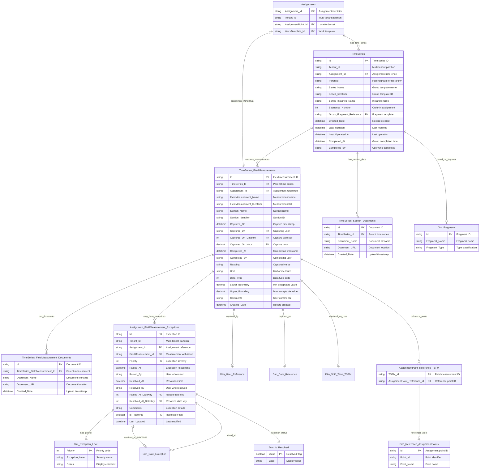

# ERD #3: Field Measurements & Time Series

**Purpose**: Data capture and measurement tracking framework showing how field measurements are recorded, organized into time series, and monitored for exceptions.

**Domain**: Field Data Collection & Quality Management

**Last Updated**: November 18, 2025

---

## Entity Relationship Diagram



---

## Tables in This ERD

| Table | Type | Purpose |
|-------|------|---------|
| **TimeSeries** | Fact | Groups within assignments containing field measurements (supports parent-child hierarchy and multiple instances) |
| **TimeSeries_FieldMeasurements** | Fact | Individual captured field measurements with values and metadata |
| **TimeSeries_Section_Documents** | Fact | Documents attached to time series sections |
| **TimeSeries_FieldMeasurement_Documents** | Fact | Documents attached to individual field measurements |
| **Assignment_FieldMeasurement_Exceptions** | Fact | Quality exceptions raised on field measurements |
| **Dim_Exception_Level** | Dimension | Exception severity levels with priority and color |
| **Dim_Fragments** | Dimension | Template fragments defining measurement structures |
| **Dim_Reference_AssignmentPoints** | Dimension | Reference points for field measurements |
| **AssignmentPoint_Reference_TSFM** | Bridge | Many-to-many link between measurements and reference points |
| **Dim_Is_Resolved** | Dimension | Exception resolution status lookup |

---

## Relationships Explained

### Assignment to Time Series

**Assignments → TimeSeries** (Active, One-to-Many)
- Relationship ID: `AutoDetected_86dade37-0d91-4fd7-9089-597d1789396e`
- From: `Assignments.Assignment_Id`
- To: `TimeSeries.Assignment_Id`
- Each assignment can have multiple time series records representing different data collection groups

---

### Time Series to Field Measurements

**TimeSeries → TimeSeries_FieldMeasurements** (Active, One-to-Many)
- Relationship ID: `AutoDetected_61500c6d-28a5-4289-811c-6f61f9b1777f`
- From: `TimeSeries.Id`
- To: `TimeSeries_FieldMeasurements.TimeSeries_Id`
- Time series contains multiple field measurements organized by sequence

---

### Time Series to Documents

**TimeSeries → TimeSeries_Section_Documents** (Active, One-to-Many)
- Relationship ID: `9cd20175-2e8f-3c27-7afd-c25567a27ee1`
- From: `TimeSeries.Id`
- To: `TimeSeries_Section_Documents.TimeSeries_Id`
- Documents attached at the section level

---

### Time Series to Fragment Templates

**TimeSeries → Dim_Fragments** (Active, Many-to-One)
- Relationship ID: `2bb18119-5543-3480-74eb-521734c89a3b`
- From: `TimeSeries.Group_Fragment_Reference`
- To: `Dim_Fragments.Id`
- Links time series to the template fragment that defined its structure

---

### Field Measurements to Documents

**TimeSeries_FieldMeasurements → TimeSeries_FieldMeasurement_Documents** (Active, One-to-Many)
- Relationship ID: `d1e9e2c7-b56b-de82-623d-825182b61848`
- From: `TimeSeries_FieldMeasurements.Id`
- To: `TimeSeries_FieldMeasurement_Documents.TimeSeries_FieldMeasurement_Id`
- ToCardinality: Many
- Documents attached to individual field measurements (photos, PDFs, etc.)

---

### Field Measurements to Exceptions

**TimeSeries_FieldMeasurements → Assignment_FieldMeasurement_Exceptions** (Active, One-to-Many, Bidirectional)
- Relationship ID: `1fe12767-d1e6-1b16-9ae9-945f6e79d469`
- From: `TimeSeries_FieldMeasurements.Id`
- To: `Assignment_FieldMeasurement_Exceptions.FieldMeasurement_Id`
- CrossFilteringBehavior: BothDirections
- Exceptions raised when measurements fall outside acceptable ranges or require attention

---

### Field Measurements to User and Date

**TimeSeries_FieldMeasurements → Dim_User_Reference** (Active, Many-to-One)
- Relationship ID: `2535a214-0748-5348-ae0f-b7ba9a8d8334`
- From: `TimeSeries_FieldMeasurements.Captured_By`
- To: `Dim_User_Reference.User_Id`
- Tracks who captured the measurement

**TimeSeries_FieldMeasurements → Dim_Date_Reference** (Active, Many-to-One)
- Relationship ID: `ca610bbf-728e-6182-6f83-835d314d92fb`
- From: `TimeSeries_FieldMeasurements.Captured_On_Datekey`
- To: `Dim_Date_Reference.Date_Key`
- When the measurement was captured

**TimeSeries_FieldMeasurements → Dim_Shift_Time_TSFM** (Active, Many-to-One)
- Relationship ID: `b8cb6e73-da6d-8d48-d553-9996924a484c`
- From: `TimeSeries_FieldMeasurements.Captured_On_Hour`
- To: `Dim_Shift_Time_TSFM.Hour`
- Shift-based time analysis for measurements

**TimeSeries_FieldMeasurements → Dim_Date_Reference [Completed_At]** (Inactive, Many-to-One)
- Relationship ID: `1582a30e-2e3f-a0bc-df15-0772b99214a9`
- From: `TimeSeries_FieldMeasurements.Completed_At_Datekey`
- To: `Dim_Date_Reference.Date_Key`
- When the measurement section was completed

**TimeSeries_FieldMeasurements → Dim_Shift_Time_TSFM [Completed_At_Hour]** (Inactive, Many-to-One)
- Relationship ID: `66103db1-32ce-888b-13ed-daf99e42977a`
- From: `TimeSeries_FieldMeasurements.Completed_At_Hour`
- To: `Dim_Shift_Time_TSFM.Hour`
- Shift-based analysis for completion time

---

### Field Measurements to Assignment (Inactive)

**TimeSeries_FieldMeasurements → Assignments** (Inactive, Many-to-One)
- Relationship ID: `e19e9b41-76e1-db4e-6323-9a0f4d5c05a6`
- From: `TimeSeries_FieldMeasurements.Assignment_Id`
- To: `Assignments.Assignment_Id`
- Direct link to assignment (inactive as relationship via TimeSeries is active)

---

### Field Measurements to Reference Points (Many-to-Many)

**TimeSeries_FieldMeasurements → AssignmentPoint_Reference_TSFM** (Active, One-to-Many)
- Relationship ID: `b9ae31af-e724-4bf4-562e-38a47859a72a`
- From: `TimeSeries_FieldMeasurements.Id`
- To: `AssignmentPoint_Reference_TSFM.TSFM_Id`
- Bridge table enabling many-to-many relationship

**AssignmentPoint_Reference_TSFM → Dim_Reference_AssignmentPoints** (Active, Many-to-One)
- Relationship ID: `13a86506-b59f-4610-b2de-02aeb234b342`
- From: `AssignmentPoint_Reference_TSFM.AssignmentPoint_Reference_Id`
- To: `Dim_Reference_AssignmentPoints.Id`
- Links measurements to reference assignment points for location context

---

### Exceptions to Priority Levels

**Assignment_FieldMeasurement_Exceptions → Dim_Exception_Level** (Active, Many-to-One)
- Relationship ID: `4a4de894-2152-6cd5-567d-c7512fabe415`
- From: `Assignment_FieldMeasurement_Exceptions.Priority`
- To: `Dim_Exception_Level.Priority`
- Lookup for exception severity levels and display colors

---

### Exceptions to Date Dimensions

**Assignment_FieldMeasurement_Exceptions → Dim_Date_Exception** (Active, Many-to-One)
- Relationship ID: `2883a83b-91be-f7e5-46b7-aeb002f2a252`
- From: `Assignment_FieldMeasurement_Exceptions.Raised_At_DateKey`
- To: `Dim_Date_Exception.Date_Key`
- When exception was raised

**Assignment_FieldMeasurement_Exceptions → Dim_Date_Exception [Resolved_At]** (Inactive, Many-to-One)
- Relationship ID: `b7949e2b-f546-12df-e1a7-213e01533b3c`
- From: `Assignment_FieldMeasurement_Exceptions.Resolved_At_DateKey`
- To: `Dim_Date_Exception.Date_Key`
- When exception was resolved - use with USERELATIONSHIP

---

### Exceptions to Resolution Status

**Assignment_FieldMeasurement_Exceptions → Dim_Is_Resolved** (Active, Many-to-One)
- Relationship ID: `9e99f7d7-2f1e-0508-a8d7-e7dae62392be`
- From: `Assignment_FieldMeasurement_Exceptions.Is_Resolved`
- To: `Dim_Is_Resolved.Value`
- Boolean lookup for exception resolution status

---

## Key Data Model Patterns

### Hierarchical Data Capture Structure - Groups and Instances
TimeSeries represents **Groups** within an assignment, not individual measurements. The term "time series" comes from the ability to have multiple instances of the same group template. Key concepts:

- **Groups**: Organizational containers defined by template fragments (via Group_Fragment_Reference)
- **Parent-Child Hierarchy**: Groups can nest within other groups via ParentId, creating hierarchies of any depth
- **Multiple Instances**: The same group template can be instantiated multiple times (Series_Name defines the template, Series_Instance_Name identifies each instance)
- **Sequence**: Groups are ordered within assignments via Sequence_Number

**Real-World Example - Mining Truck Pre-Start Inspection:**

An assignment "Truck 405 Pre-Start" contains these Level 0 (top-level) groups:
1. **Pre-Start Checks** (Group)
   - Contains sections: Engine, Fluids, Belts & Hoses, Cabin Safety, Tyres (4 tyres as sections within this one group)
   - Single instance - one set of checks per assignment
2. **Work Requests / Notifications** (Group)
   - Instance 1: "Brake warning light on dashboard"
   - Instance 2: "Left mirror cracked"
   - Instance 3: "Oil leak observed"
   - Multiple instances = time series pattern (zero to many notifications)
3. **Safety Step-Back Take-5** (Group)
   - Contains sections: Hazard identification, Control measures, Stop work authority
   - Single instance - one safety assessment per assignment

Within each group, field measurements capture the actual data (tire pressure readings, pass/fail checks, photos, text observations). This three-level hierarchy (Assignment → Groups/TimeSeries → FieldMeasurements) mirrors the template structure defined by fragments.

### Incremental Refresh for Large Fact Tables
Both TimeSeries and TimeSeries_FieldMeasurements use incremental refresh with a 5-year rolling window based on Created_Date. This pattern reduces refresh time and model size for high-volume data capture scenarios where millions of measurements accumulate over time.

### Template-Driven Data Collection
The Group_Fragment_Reference in TimeSeries links to Dim_Fragments, establishing which template fragment defined the structure. This enables analysis by template type and supports template evolution tracking.

### Exception Management with Priority Levels
Assignment_FieldMeasurement_Exceptions implements a quality management pattern. When measurements fall outside Lower_Boundary/Upper_Boundary ranges or require attention, exceptions are raised with priority levels. The Dim_Exception_Level provides severity classification with visual color coding. Exceptions track both raised and resolved timestamps with user attribution.

### Many-to-Many Reference Points
AssignmentPoint_Reference_TSFM bridge table enables field measurements to reference multiple assignment points. This supports scenarios where a single measurement applies to multiple locations or assets.

### Document Attachments
Two document tables support attachments at different granularity levels: TimeSeries_Section_Documents for section-level attachments and TimeSeries_FieldMeasurement_Documents for individual measurement photos/documents. This flexible attachment model supports various documentation requirements.

### Bidirectional Filtering for Exceptions
The relationship between TimeSeries_FieldMeasurements and Assignment_FieldMeasurement_Exceptions uses bidirectional cross-filtering, enabling filtering measurements by exception status and exceptions by measurement attributes in both directions.

---

## Common DAX Query Patterns

### Count Measurements by Date
```dax
Measurements Today = 
CALCULATE(
    COUNTROWS(TimeSeries_FieldMeasurements),
    Dim_Date_Reference[Date] = TODAY()
)
```

### Measurements with Exceptions
```dax
Measurements with Issues = 
CALCULATE(
    COUNTROWS(TimeSeries_FieldMeasurements),
    NOT ISEMPTY(Assignment_FieldMeasurement_Exceptions)
)
```

### Exception Rate
```dax
Exception Rate % = 
DIVIDE(
    COUNTROWS(Assignment_FieldMeasurement_Exceptions),
    COUNTROWS(TimeSeries_FieldMeasurements),
    0
) * 100
```

### Unresolved Exceptions
```dax
Open Exceptions = 
CALCULATE(
    COUNTROWS(Assignment_FieldMeasurement_Exceptions),
    Dim_Is_Resolved[Value] = FALSE()
)
```

### Average Resolution Time
```dax
Avg Resolution Days = 
AVERAGEX(
    FILTER(
        Assignment_FieldMeasurement_Exceptions,
        NOT ISBLANK([Resolved_At])
    ),
    DATEDIFF([Raised_At], [Resolved_At], DAY)
)
```

### Measurements by User
```dax
My Measurements = 
CALCULATE(
    COUNTROWS(TimeSeries_FieldMeasurements),
    Dim_User_Reference[Email] = USERPRINCIPALNAME()
)
```

### Measurements by Shift
```dax
Night Shift Measurements = 
CALCULATE(
    COUNTROWS(TimeSeries_FieldMeasurements),
    Dim_Shift_Time_TSFM[Shift_Type] = "Night"
)
```

### Out of Range Measurements
```dax
Out of Range Count = 
CALCULATE(
    COUNTROWS(TimeSeries_FieldMeasurements),
    OR(
        TimeSeries_FieldMeasurements[Reading] < TimeSeries_FieldMeasurements[Lower_Boundary],
        TimeSeries_FieldMeasurements[Reading] > TimeSeries_FieldMeasurements[Upper_Boundary]
    )
)
```

### Measurements with Documents
```dax
Measurements with Photos = 
CALCULATE(
    COUNTROWS(TimeSeries_FieldMeasurements),
    NOT ISEMPTY(TimeSeries_FieldMeasurement_Documents)
)
```

### High Priority Exceptions
```dax
Critical Exceptions = 
CALCULATE(
    COUNTROWS(Assignment_FieldMeasurement_Exceptions),
    Dim_Exception_Level[Exception_Level] = "Critical"
)
```

### Time Series Completion Rate
```dax
Time Series Completion % = 
VAR TotalMeasurements = COUNTROWS(TimeSeries_FieldMeasurements)
VAR CompletedMeasurements = 
    CALCULATE(
        COUNTROWS(TimeSeries_FieldMeasurements),
        NOT ISBLANK(TimeSeries_FieldMeasurements[Completed_At])
    )
RETURN
    DIVIDE(CompletedMeasurements, TotalMeasurements, 0) * 100
```

---

## Exception Priority Levels

The Dim_Exception_Level table defines these severity levels:
- **Priority 1**: Critical - Requires immediate attention
- **Priority 2**: High - Requires prompt resolution
- **Priority 3**: Medium - Standard priority
- **Priority 4**: Low - Can be addressed during routine work

Each level has an associated color code for visual indication in reports.

---

## Related Documentation

### Individual Table Documentation
- [TimeSeries](../tables/TimeSeries.md) - Time series container details
- [TimeSeries_FieldMeasurements](../tables/TimeSeries_FieldMeasurements.md) - Field measurement specifications
- [Assignment_FieldMeasurement_Exceptions](../tables/Assignment_FieldMeasurement_Exceptions.md) - Exception tracking

### Related ERDs
- **ERD #1**: Assignment Core Model (assignments create time series)
- **ERD #2**: Date Dimensions & Time Intelligence (date filtering for measurements)
- **ERD #6**: Templates, Fragments & Configuration (template fragments define structure)

### Overview Documentation
- [ERD_Overview](../ERD_Overview.md) - Complete model overview and navigation

---

## Change History

| Date | Change | Author |
|------|--------|--------|
| 2025-11-18 | Initial ERD documentation created from TMDL files | AI Documentation Generator |
