# ERD #4: Assignment Details & Snapshots

**Purpose**: Historical tracking and additional assignment attributes including progress snapshots, field operator assignments, tags, decline reasons, and location attributes.

**Domain**: Assignment Metadata & Historical Tracking

**Last Updated**: November 18, 2025

---

## Entity Relationship Diagram

```mermaid
erDiagram
    Assignments ||--o{ Assignment_Details_Snapshot : "has_history"
    Assignments ||--o| Assignment_Completion_Percentage_Snapshot : "has_progress"
    Assignments ||--o| Assignment_FromDate_First_Snapshot : "has_first_date"
    Assignments ||--o{ Assignment_FieldOperators : "assigned_operators"
    Assignments ||--o{ Assignment_Tags : "has_tags"
    Assignments ||--o| Assignment_Declined_Reasons : "has_decline_reason"
    
    Assignment_FieldOperators ||--o| Dim_User_Reference : "operator_INACTIVE"
    
    Dim_AssignmentPoints ||--o{ AssignmentPoint_Attributes : "has_attributes"
    
    Assignments {
        string Assignment_Id PK "Assignment identifier"
        string Tenant_Id "Multi-tenant partition"
        string AssignmentPoint_Id FK "Location/asset"
        string Assigned_To FK "User assigned"
        string Team_Id FK "Team assigned"
        int Status_Id FK "Status code"
        datetime From_Date "Start date"
        datetime Completed_On "Completion date"
        datetime Finalised_On "Finalisation date"
    }
    
    Assignment_Details_Snapshot {
        string Assignment_Id FK "Assignment reference"
        datetime Snapshot_Timestamp "When snapshot taken"
        int Status_Id "Status at snapshot time"
        string User_Id "User at snapshot time"
        string Team_Id "Team at snapshot time"
        string Assigned_To "Assignee at snapshot time"
        datetime From_Date "From date at snapshot"
        datetime To_Date "To date at snapshot"
    }
    
    Assignment_Completion_Percentage_Snapshot {
        string AssignmentId PK "Assignment reference"
        decimal Total_Percent "Overall completion %"
        decimal Work_Percent "Work completed %"
    }
    
    Assignment_FromDate_First_Snapshot {
        string Assignment_Id PK "Assignment reference"
        datetime From_Date_First "Original start date"
        datetime From_Date_Current "Current start date"
    }
    
    Assignment_FieldOperators {
        string Assignment_Id FK "Assignment reference"
        string FieldOperator_Id FK "Operator user ID"
        string Operator_Name "Operator display name"
    }
    
    Assignment_Tags {
        string Assignment_Id FK "Assignment reference"
        string Key "Tag attribute name"
        string Value "Tag attribute value"
    }
    
    Assignment_Declined_Reasons {
        string Id PK "Decline record ID"
        string Assignment_Id FK "Assignment reference"
        string Declined_By "User who declined"
        datetime Declined_On "Decline timestamp"
        string Declined_By_FullName "Decliner name"
        string ReasonFor_Declining "Decline reason code"
        string ReasonFor_Declining_Comment "Decline comment"
        datetime Created_Date "Record created"
    }
    
    AssignmentPoint_Attributes {
        string AssignmentPoint_Id FK "Assignment point reference"
        string Key "Attribute name"
        string Value "Attribute value"
    }
    
    Dim_AssignmentPoints {
        string Id PK "Assignment point ID"
        string Point_Id "Point identifier"
        string Point_Name "Point name"
    }
```



---

## Tables in This ERD

| Table | Type | Purpose |
|-------|------|---------|
| **Assignment_Details_Snapshot** | Fact | Historical snapshots of assignment state changes (SCD Type 2 pattern) |
| **Assignment_Completion_Percentage_Snapshot** | Fact | Current progress metrics for assignments (total % and work %) |
| **Assignment_FromDate_First_Snapshot** | Fact | Tracks original vs current start dates for rescheduled assignments |
| **Assignment_FieldOperators** | Bridge | Many-to-many link between assignments and field operators |
| **Assignment_Tags** | Fact | Flexible key-value attributes for assignments (EAV pattern) |
| **Assignment_Declined_Reasons** | Fact | Records when and why assignments were declined |
| **AssignmentPoint_Attributes** | Fact | Flexible key-value attributes for assignment points (EAV pattern) |

---

## Relationships Explained

### Assignment to Snapshots and History

**Assignments → Assignment_Details_Snapshot** (Active, One-to-Many)
- Relationship ID: `AutoDetected_d6a10b22-d215-4dde-88a6-1f8570d2d356`
- From: `Assignments.Assignment_Id`
- To: `Assignment_Details_Snapshot.Assignment_Id`
- Insert-only historical tracking of assignment state changes
- Each row represents the assignment's state at a specific point in time
- Captures changes to status, assigned user, team, and dates

**Assignments → Assignment_Completion_Percentage_Snapshot** (Active, One-to-One, Bidirectional)
- Relationship ID: `17c1c51f-96f8-2a2b-60b2-0c147ebe89f0`
- From: `Assignments.Assignment_Id`
- To: `Assignment_Completion_Percentage_Snapshot.AssignmentId`
- FromCardinality: One
- CrossFilteringBehavior: BothDirections
- Current progress snapshot showing completion percentages

**Assignments → Assignment_FromDate_First_Snapshot** (Active, One-to-One, Bidirectional)
- Relationship ID: `612a8bc8-b069-ccb4-fe18-b9710f9896a6`
- From: `Assignments.Assignment_Id`
- To: `Assignment_FromDate_First_Snapshot.Assignment_Id`
- FromCardinality: One
- CrossFilteringBehavior: BothDirections
- Tracks original start date vs current start date for reschedule analysis

---

### Assignment to Field Operators (Many-to-Many)

**Assignment_FieldOperators → Assignments** (Active, Many-to-One, Bidirectional)
- Relationship ID: `e0dd5bf6-8fc0-4529-9cf6-07b1b965b4e9`
- From: `Assignment_FieldOperators.Assignment_Id`
- To: `Assignments.Assignment_Id`
- CrossFilteringBehavior: BothDirections
- Bridge table enabling multiple field operators per assignment
- Field operators are users who perform work in the field (distinct from "Assigned To")

**Assignment_FieldOperators → Dim_User_Reference** (Inactive, Many-to-One)
- Relationship ID: `a50c4e0f-6de6-feeb-fb07-ca5395d8cb52`
- From: `Assignment_FieldOperators.FieldOperator_Id`
- To: `Dim_User_Reference.User_Id`
- Inactive relationship - user details already merged into Operator_Name

---

### Assignment to Tags (EAV Pattern)

**Assignment_Tags → Assignments** (Active, Many-to-One)
- Relationship ID: `AutoDetected_b2e2c3ed-9468-4ea6-b7c4-a966f195b744`
- From: `Assignment_Tags.Assignment_Id`
- To: `Assignments.Assignment_Id`
- Entity-Attribute-Value pattern for flexible metadata
- Enables custom attributes without schema changes
- Common keys: Work Order Number, Equipment ID, Priority, Custom fields

---

### Assignment to Decline Reasons

**Assignment_Declined_Reasons → Assignments** (Active, One-to-One, Bidirectional)
- Relationship ID: `793809b9-d354-88ba-df9a-9ec29dcce46b`
- From: `Assignment_Declined_Reasons.Assignment_Id`
- To: `Assignments.Assignment_Id`
- FromCardinality: One
- CrossFilteringBehavior: BothDirections
- Records who declined assignment, when, and why

---

### Assignment Point to Attributes (EAV Pattern)

**AssignmentPoint_Attributes → Dim_AssignmentPoints** (Active, Many-to-One, Bidirectional)
- Relationship ID: `92259416-4abf-a602-1bf6-141f428dde68`
- From: `AssignmentPoint_Attributes.AssignmentPoint_Id`
- To: `Dim_AssignmentPoints.Id`
- CrossFilteringBehavior: BothDirections
- Entity-Attribute-Value pattern for flexible location metadata
- Common keys: Asset Number, Manufacturer, Model, Serial Number, Installation Date

---

## Key Data Model Patterns

### Slowly Changing Dimension Type 2 (Assignment_Details_Snapshot)
Assignment_Details_Snapshot implements SCD Type 2 pattern for historical state tracking. Each state change creates a new snapshot row with Snapshot_Timestamp. This enables:
- Point-in-time analysis: "What was the status on March 15?"
- Change tracking: "When did the assignment move to In Progress?"
- Duration calculations: "How long was it assigned to User X?"
- Audit trail: Complete history of assignment modifications

The table uses incremental refresh with 3-year rolling window and 2-day incremental granularity based on Snapshot_Timestamp.

### Entity-Attribute-Value (EAV) Pattern
Assignment_Tags and AssignmentPoint_Attributes use EAV pattern for flexible, schema-less metadata storage:
- **Key**: Attribute name (e.g., "Work Order Number", "Equipment ID")
- **Value**: Attribute value (stored as string, can represent any type)
- **Benefits**: Add new attributes without schema changes, tenant-specific fields, integration metadata
- **Tradeoffs**: Less type-safe than dedicated columns, requires filtering/pivoting for analysis

### Bridge Tables for Many-to-Many
Assignment_FieldOperators implements many-to-many relationship between assignments and users. Bidirectional filtering enables:
- From assignments: "Who are the field operators?"
- From users: "Which assignments is this operator working on?"

Multiple field operators per assignment supports team-based fieldwork where several users collaborate on one assignment.

### Progress Snapshot (One-to-One Current State)
Assignment_Completion_Percentage_Snapshot maintains current completion metrics (Total_Percent, Work_Percent) in a separate table. One-to-one bidirectional relationship enables:
- Filtering assignments by completion percentage
- Completion-based slicers and KPIs
- Separation of transactional data (Assignments) from calculated metrics (progress)

### Reschedule Tracking
Assignment_FromDate_First_Snapshot captures original vs current start dates. This enables analysis of:
- Rescheduled assignments (From_Date_First ≠ From_Date_Current)
- Schedule variance (days between original and current)
- Rescheduling patterns by location, team, or template

### Incremental Refresh Strategy
Assignment_Details_Snapshot uses incremental refresh (3-year window, 2-day increments) to handle high-volume historical data. This reduces refresh time and model size while maintaining sufficient history for analysis.

---

## Common DAX Query Patterns

### Assignments by Current Status
```dax
Open Assignments = 
CALCULATE(
    COUNTROWS(Assignments),
    Assignments[Status_Id] = 1
)
```

### Status Duration Calculation
```dax
Days in Status = 
AVERAGEX(
    Assignment_Details_Snapshot,
    DATEDIFF(
        [Snapshot_Timestamp],
        CALCULATE(
            MAX(Assignment_Details_Snapshot[Snapshot_Timestamp]),
            ALLEXCEPT(Assignment_Details_Snapshot, Assignment_Details_Snapshot[Assignment_Id]),
            Assignment_Details_Snapshot[Snapshot_Timestamp] < EARLIER(Assignment_Details_Snapshot[Snapshot_Timestamp])
        ),
        DAY
    )
)
```

### Average Completion Percentage
```dax
Avg Completion % = 
AVERAGE(Assignment_Completion_Percentage_Snapshot[Total_Percent])
```

### Rescheduled Assignments Count
```dax
Rescheduled Count = 
CALCULATE(
    COUNTROWS(Assignments),
    Assignment_FromDate_First_Snapshot[From_Date_First] 
        <> Assignment_FromDate_First_Snapshot[From_Date_Current]
)
```

### Schedule Variance Days
```dax
Avg Schedule Variance = 
AVERAGEX(
    FILTER(
        Assignment_FromDate_First_Snapshot,
        [From_Date_First] <> [From_Date_Current]
    ),
    DATEDIFF([From_Date_First], [From_Date_Current], DAY)
)
```

### Assignments by Field Operator
```dax
My Field Assignments = 
CALCULATE(
    COUNTROWS(Assignments),
    Assignment_FieldOperators[Operator_Name] = "John Smith"
)
```

### Field Operator Count per Assignment
```dax
Operator Count = 
CALCULATE(
    DISTINCTCOUNT(Assignment_FieldOperators[FieldOperator_Id]),
    ALLEXCEPT(Assignments, Assignments[Assignment_Id])
)
```

### Filter by Tag Value
```dax
High Priority Assignments = 
CALCULATE(
    COUNTROWS(Assignments),
    Assignment_Tags[Key] = "Priority",
    Assignment_Tags[Value] = "High"
)
```

### Declined Assignments Count
```dax
Declined Count = 
CALCULATE(
    COUNTROWS(Assignments),
    NOT ISBLANK(Assignment_Declined_Reasons[Declined_On])
)
```

### Decline Rate by Reason
```dax
Decline Rate = 
DIVIDE(
    COUNTROWS(Assignment_Declined_Reasons),
    COUNTROWS(Assignments),
    0
) * 100
```

### Assignment Point with Specific Attribute
```dax
Points with Asset Number = 
CALCULATE(
    DISTINCTCOUNT(Dim_AssignmentPoints[Id]),
    AssignmentPoint_Attributes[Key] = "Asset Number"
)
```

### Historical Status at Point in Time
```dax
Status on Date = 
CALCULATE(
    LASTNONBLANK(
        Assignment_Details_Snapshot[Status_Id],
        1
    ),
    FILTER(
        Assignment_Details_Snapshot,
        Assignment_Details_Snapshot[Snapshot_Timestamp] <= DATE(2025, 3, 15)
    )
)
```

---

## Common Tag Keys and Usage

### Assignment_Tags Common Keys
- **Work Order Number**: External work order reference
- **Equipment ID**: Specific equipment identifier
- **Priority**: Custom priority classification
- **Cost Center**: Financial allocation
- **Project Code**: Project tracking
- **External Reference**: Integration system IDs
- **Custom Fields**: Tenant-specific attributes

### AssignmentPoint_Attributes Common Keys
- **Asset Number**: Asset management system ID
- **Manufacturer**: Equipment manufacturer
- **Model**: Equipment model number
- **Serial Number**: Equipment serial number
- **Installation Date**: Equipment install date
- **Maintenance Due**: Next maintenance date
- **Capacity**: Equipment capacity specs

---

## Related Documentation

### Individual Table Documentation
- [Assignment_Details_Snapshot](../tables/Assignment_Details_Snapshot.md) - Historical state tracking
- [Assignment_FieldOperators](../tables/Assignment_FieldOperators.md) - Field operator assignments
- [Assignment_Tags](../tables/Assignment_Tags.md) - Flexible attributes

### Related ERDs
- **ERD #1**: Assignment Core Model (assignments being tracked here)
- **ERD #5**: User, Team & Security (field operators and decline users)
- **ERD #7**: Fact Tables & Audit (complementary audit tracking)

### Overview Documentation
- [ERD_Overview](../ERD_Overview.md) - Complete model overview and navigation

---

## Change History

| Date | Change | Author |
|------|--------|--------|
| 2025-11-18 | Initial ERD documentation created from TMDL files | AI Documentation Generator |
