# ERD #5: User, Team & Security

## Overview

This ERD documents the user, team membership, and row-level security (RLS) infrastructure that controls data access across the multi-tenant Obzervr platform. The model includes user reference data, team membership with supervisor/member roles, RLS user mappings, role definitions, tenant-specific analytics access control, and tenant configuration settings.

**Key Components:**
- **User Reference**: Central user dimension providing consistent user attributes across all role-playing user dimensions
- **Team Membership**: Many-to-many relationship between users and teams with supervisor/member flags
- **Row-Level Security**: RLS_Users table with filtered user lists, RLS_Roles lookup, and tenant analytics access control
- **Multi-Tenancy**: Dim_Tenant dimension providing tenant settings, branding, timezone configuration, and custom labels

**Relationships:**
- 6 tables with 7 direct relationships
- Bidirectional filtering on Team_Users to Dim_Teams (enables team-based filtering)
- Many-to-many relationship between Team_Users and RLS_Users
- Inactive relationship between Team_Users and RLS_Tenant_User_Analytic for analytics access control
- Multiple fact tables and user dimension variants connect to Dim_User_Reference and Dim_Tenant

## Entity Relationship Diagram

```mermaid
erDiagram
    Dim_User_Reference {
        string User_Id PK "Identifier of the user"
        string Email "User email address"
        string Full_Name "User's full display name"
        string Full_Name_Email "Combined display of full name and email"
        string Role "User role or job title"
        string User_Code "Internal user code"
        string Reference_Code "External reference code for the user"
        string Authorisation_Code "Authorization code assigned to the user"
        string Department "Department name the user belongs to"
        string Department_Code "Department code used for reporting"
        string Organisation "Organisation name the user belongs to"
        string Organisation_Code "Organisation code used for reporting"
    }
    
    Team_Users {
        string Team "Display name of the team for this user"
        string Tenant_Id FK "Tenant identifier for the team membership"
        string User_Id FK "Identifier of the user"
        string Team_Id FK "Identifier of the team"
        boolean Is_Supervisor "Flag indicating whether the user is a supervisor"
        boolean Is_Member "Flag indicating whether the user is a team member"
        datetime Created_Date "Record creation timestamp"
        datetime Last_Updated "Last update timestamp for the record"
        string User_TenantId "Combined user and tenant identifier"
    }
    
    RLS_Users {
        string Unique_User_Id "Unique identifier for the user in RLS mappings"
        string Email "User email address"
        boolean Is_Active "Flag indicating whether the user is active"
        string Tenant_Id FK "Tenant identifier for the user"
        string User_Id FK "Internal user identifier"
        datetime Last_Updated "Last update timestamp for this RLS user record"
        string Full_Name "Full display name for the user"
        string User_Tenant_Id "Concatenated user and tenant identifier"
        int Has_Tenant_Analytics "Indicator whether the tenant has analytics enabled"
    }
    
    RLS_Roles {
        int Id PK "Numeric role identifier"
        string Name "Role name used for row-level security"
    }
    
    RLS_Tenant_User_Analytic {
        string User_Id FK "User identifier"
        string Tenant_Id FK "Tenant identifier"
        string Tenant_Code "Tenant code (calculated from Dim_Tenant)"
    }
    
    Dim_Tenant {
        string Tenant_Id PK "Tenant identifier"
        string Tenant_Code "Tenant code"
        string Timezone "Tenant timezone"
        string Logo_Base64 "Base64 encoded tenant logo (hidden)"
        string Tenant_Name "Tenant name"
        string Tenant_URL "Tenant URL"
        string Offset_Minutes "Timezone offset in minutes"
        string Primary_Colour "Primary branding colour"
        string Secondary_Colour "Secondary branding colour"
        string Assignment_PointList_1 "Custom label for assignment point list 1"
        string Assignment_Point_List_2 "Custom label for assignment point list 2"
        string Template_List_1 "Custom label for template list 1"
        string Template_List_2 "Custom label for template list 2"
        string Series_List_1 "Custom label for series list 1"
        string Series_List_2 "Custom label for series list 2"
        string OrganisationKey "Organisation key"
        string Tenant "Calculated: Tenant_Code - Tenant_Name"
    }
    
    Team_Users ||--o{ Dim_Teams : "Team_Id (bidirectional)"
    Team_Users }o--o{ RLS_Users : "User_Id (many-to-many)"
    Team_Users }o--o{ RLS_Tenant_User_Analytic : "Tenant_Id (inactive, bidirectional, many-to-many)"
    
    Dim_Users_AssignedTo ||--|| Dim_User_Reference : "User_Id (calculated table source)"
    Dim_Users_CompletedBy ||--|| Dim_User_Reference : "User_Id"
    Dim_Users_FinalisedBy ||--|| Dim_User_Reference : "User_Id"
    TimeSeries_FieldMeasurements }o--|| Dim_User_Reference : "Captured_By"
    Fact_User_LogOn_Activities }o--|| Dim_User_Reference : "User_Id"
    Fact_User_Audit_Command_Count_By_Day }o--|| Dim_User_Reference : "User_Id"
    Fact_User_Assignment_Audit }o--|| Dim_User_Reference : "User_Id"
    Dim_Worklist_Views }o--|| Dim_User_Reference : "Created_By"
    
    Assignments }o--|| Dim_Tenant : "Tenant_Id"
    Dim_Shifts }o--|| Dim_Tenant : "Tenant_Id"
    Dim_Shift_Time_FromDate }o--|| Dim_Tenant : "Tenant_Id"
    Dim_Shift_Time_CompletedOn }o--|| Dim_Tenant : "Tenant_Id"
    TimeSeries }o--|| Dim_Tenant : "Tenant_Id"
    TimeSeries_FieldMeasurements }o--|| Dim_Tenant : "Tenant_Id"
    Fact_User_Audit_Command_Count_By_Day }o--|| Dim_Tenant : "Tenant_Id"
    Dim_Worklist_Views }o--|| Dim_Tenant : "Tenant_Id"
```



## Table Inventory

### 1. Dim_User_Reference (Dimension - Calculated Table)
**Purpose:** Central user reference dimension providing consistent user attributes across all role-playing user dimensions (AssignedTo, CompletedBy, FinalisedBy). Source data from Dim_Users_AssignedTo.

**Columns:** 12 (User_Id, Email, Full_Name, Full_Name_Email, Role, User_Code, Reference_Code, Authorisation_Code, Department, Department_Code, Organisation, Organisation_Code)

**Key Attributes:**
- Calculated table sourced from Dim_Users_AssignedTo
- Contains user identity, role, department, organisation attributes
- Used as lookup dimension for all user-related relationships in fact tables
- Consistent user attributes across all role-playing scenarios

**Relationships:** Target of relationships from Dim_Users_AssignedTo, Dim_Users_CompletedBy, Dim_Users_FinalisedBy (role-playing dimensions), TimeSeries_FieldMeasurements (Captured_By), Fact_User_LogOn_Activities, Fact_User_Audit_Command_Count_By_Day, Fact_User_Assignment_Audit, Dim_Worklist_Views (Created_By)

---

### 2. Team_Users (Bridge Table - Many-to-Many)
**Purpose:** Bridge table managing many-to-many relationships between users and teams with supervisor/member role flags. Enables team-based filtering and role-based access control.

**Columns:** 10 (Team [calculated], Tenant_Id, User_Id, Team_Id, Is_Supervisor, Is_Member, Created_Date, Last_Updated, User_TenantId, LastLoaded)

**Key Attributes:**
- Many-to-many bridge between users and teams
- Supports dual roles: supervisor flag and member flag (can be both)
- Multi-tenant scope with Tenant_Id
- User_TenantId composite key for cross-filtering
- Calculated Team column from related Dim_Teams[Name]

**Relationships:** 
- **Bidirectional to Dim_Teams** (Team_Id) - Relationship ID: AutoDetected_c903dad1-2b7c-46d9-82ab-c5e0f5206638 (both directions filtering, both directions security)
- **Many-to-many to RLS_Users** (User_Id) - Relationship ID: f63b5255-18bb-7fe9-6b65-7eef23f72204 (many cardinality)
- **Inactive bidirectional many-to-many to RLS_Tenant_User_Analytic** (Tenant_Id) - Relationship ID: 63d8ef54-8763-6b2b-8fc9-5f1f2016bd48 (used for analytics access control)

**Source:** SQL query from FactTeamUsers table with tenant filtering (AllTenants or specific TenantId1-5)

---

### 3. RLS_Users (Security Table)
**Purpose:** Filtered user list for row-level security implementation. Contains active users with tenant associations and analytics access flags for security filtering.

**Columns:** 9 (Unique_User_Id, Email, Is_Active, Tenant_Id, User_Id, Last_Updated, Full_Name, User_Tenant_Id, Has_Tenant_Analytics)

**Key Attributes:**
- All columns hidden (security table)
- Source: DimUsers table filtered for active users only
- Has_Tenant_Analytics flag (0/1) derived from left outer join to Tenant_Analytic_Users
- User_Tenant_Id composite key for multi-tenant user identification
- Used in RLS rules and filter context for data access control

**Relationships:** Target of many-to-many relationship from Team_Users (User_Id)

**Source:** SQL query from DimUsers with active user filter and analytics tenant join

---

### 4. RLS_Roles (Lookup Table)
**Purpose:** Static lookup table defining role IDs and names used in row-level security rules. Provides standardized role definitions for security filtering.

**Columns:** 2 (Id, Name)

**Key Attributes:**
- Static reference table with hardcoded values
- Id column (int) sorted by itself
- Name column sorted by Id
- Source: Embedded JSON data in M query (compressed binary)
- No relationships to other tables (used in DAX security expressions)

**Source:** Table.FromRows with compressed JSON data

---

### 5. RLS_Tenant_User_Analytic (Security Bridge Table)
**Purpose:** Filtered bridge table identifying users with analytics access for specific tenants. Derived from RLS_Users filtered to Has_Tenant_Analytics = 1.

**Columns:** 3 (User_Id, Tenant_Id, Tenant_Code [calculated])

**Key Attributes:**
- Hidden table used for analytics access control
- Calculated Tenant_Code column via LOOKUPVALUE to Dim_Tenant
- Source: RLS_Users filtered where Has_Tenant_Analytics = 1
- Reduced column set (only User_Id, Tenant_Id retained from source)

**Relationships:** 
- **Inactive bidirectional many-to-many from Team_Users** (Tenant_Id) - Relationship ID: 63d8ef54-8763-6b2b-8fc9-5f1f2016bd48 (both directions filtering)

**Source:** Power Query reference to RLS_Users with Has_Tenant_Analytics filter

---

### 6. Dim_Tenant (Dimension)
**Purpose:** Tenant (organization/customer) dimension providing tenant settings, branding configuration, timezone settings, and custom UI labels for multi-tenant environments.

**Columns:** 17 (Tenant_Id, Tenant_Code, Timezone, Logo_Base64 [hidden], Tenant_Name, Tenant_URL, Offset_Minutes, Primary_Colour, Secondary_Colour, Assignment_PointList_1, Assignment_Point_List_2, Template_List_1, Template_List_2, Series_List_1, Series_List_2, OrganisationKey, Tenant [calculated])

**Key Attributes:**
- Tenant_Id primary key
- Logo_Base64 hidden, categorized as ImageUrl
- Tenant_URL categorized as WebUrl
- Offset_Minutes derived from Fn_ConvertTimezonetoOffsetMinutes function
- Calculated Tenant column: Tenant_Code & " - " & Tenant_Name
- Custom list labels (Assignment_PointList_1/2, Template_List_1/2, Series_List_1/2) for UI customization
- Branding colours (Primary_Colour, Secondary_Colour)

**Relationships:** Target of relationships from Assignments, Dim_Shifts, Dim_Shift_Time_FromDate, Dim_Shift_Time_CompletedOn, TimeSeries, TimeSeries_FieldMeasurements, Fact_User_Audit_Command_Count_By_Day, Dim_Worklist_Views (all on Tenant_Id)

**Source:** SQL query from TenantSettings table with tenant filtering and timezone offset calculation

---

## Relationship Details

### Team Membership Relationships

**Team_Users to Dim_Teams** (Relationship ID: AutoDetected_c903dad1-2b7c-46d9-82ab-c5e0f5206638)
- **Type:** Many-to-one
- **From:** Team_Users[Team_Id]
- **To:** Dim_Teams[Team_Id]
- **Cross-filtering:** Both directions
- **Security filtering:** Both directions
- **Purpose:** Bidirectional relationship enables filtering teams by users and users by teams. Security filtering in both directions ensures RLS rules apply correctly.

**Team_Users to RLS_Users** (Relationship ID: f63b5255-18bb-7fe9-6b65-7eef23f72204)
- **Type:** Many-to-many
- **From:** Team_Users[User_Id]
- **To:** RLS_Users[User_Id]
- **Cardinality:** To-many
- **Purpose:** Many-to-many bridge relationship for RLS filtering. Users can belong to multiple teams, and RLS_Users provides the security filter context.

**Team_Users to RLS_Tenant_User_Analytic** (Relationship ID: 63d8ef54-8763-6b2b-8fc9-5f1f2016bd48)
- **Type:** Many-to-many (inactive)
- **From:** Team_Users[Tenant_Id]
- **To:** RLS_Tenant_User_Analytic[Tenant_Id]
- **Cross-filtering:** Both directions
- **Cardinality:** To-many
- **Active:** False
- **Purpose:** Inactive relationship used with USERELATIONSHIP in DAX for analytics access control. Filters team membership to users with tenant analytics privileges.

### User Reference Relationships

**Dim_Users_* to Dim_User_Reference** (3 relationships)
- **From tables:** Dim_Users_AssignedTo, Dim_Users_CompletedBy, Dim_Users_FinalisedBy
- **To:** Dim_User_Reference[User_Id]
- **Purpose:** Role-playing dimension pattern. Dim_User_Reference is a calculated table sourced from Dim_Users_AssignedTo, providing consistent user attributes for all role-playing scenarios (AssignedTo, CompletedBy, FinalisedBy).

**Fact tables to Dim_User_Reference** (5 relationships)
- **From tables:** TimeSeries_FieldMeasurements (Captured_By), Fact_User_LogOn_Activities (User_Id), Fact_User_Audit_Command_Count_By_Day (User_Id), Fact_User_Assignment_Audit (User_Id), Dim_Worklist_Views (Created_By)
- **To:** Dim_User_Reference[User_Id]
- **Purpose:** Standard star schema relationships from fact tables to user dimension for filtering and grouping by user attributes.

**Relationship IDs:**
- TimeSeries_FieldMeasurements: 2535a214-0748-5348-ae0f-b7ba9a8d8334
- Fact_User_LogOn_Activities: 79caf0b3-1e08-a718-a879-c8f03fe40788
- Fact_User_Audit_Command_Count_By_Day: dff26b19-858b-727e-1ce0-a2fd5440c627
- Fact_User_Assignment_Audit: 79fb91fb-b6a6-e66e-0e7b-9541f6356ab0
- Dim_Worklist_Views: b769584b-bb21-57f9-ac05-43d77a7b7c78

### Multi-Tenancy Relationships

**Fact and Dimension tables to Dim_Tenant** (8 relationships)
- **From tables:** Assignments, Dim_Shifts, Dim_Shift_Time_FromDate, Dim_Shift_Time_CompletedOn, TimeSeries, TimeSeries_FieldMeasurements, Fact_User_Audit_Command_Count_By_Day, Dim_Worklist_Views
- **To:** Dim_Tenant[Tenant_Id]
- **Purpose:** Standard star schema relationships enforcing multi-tenant data isolation. All fact tables and tenant-specific dimensions connect to Dim_Tenant for filtering by organization.

**Relationship IDs:**
- Dim_Shifts: 102
- Dim_Shift_Time_FromDate: 116
- Dim_Shift_Time_CompletedOn: 120
- TimeSeries: 124
- TimeSeries_FieldMeasurements: 128
- Fact_User_Audit_Command_Count_By_Day: AutoDetected_28d59c09-f648-4e1c-9547-5535797889dd
- Dim_Worklist_Views: c3be2bf1-d131-e98f-cb35-cc64d24f4be3

---

## Key Data Model Patterns

### 1. Role-Playing Dimension Pattern
Dim_User_Reference is a calculated table sourced from Dim_Users_AssignedTo, serving as the central user dimension. Multiple role-playing user dimensions (Dim_Users_AssignedTo, Dim_Users_CompletedBy, Dim_Users_FinalisedBy) all relate to the same Dim_User_Reference, providing consistent user attributes regardless of the user role context (who assigned, who completed, who finalized).

**Implementation:**
```dax
Dim_User_Reference = Dim_Users_AssignedTo
```

All user-related fact table columns (Captured_By, User_Id, Created_By) connect to Dim_User_Reference, enabling consistent filtering and grouping by user attributes across all role-playing scenarios.

### 2. Many-to-Many Team Membership
Team_Users serves as a bridge table implementing many-to-many relationships between users and teams. Users can belong to multiple teams with different roles (supervisor and/or member).

**Key characteristics:**
- Bidirectional cross-filtering on Team_Users to Dim_Teams enables filtering in both directions
- Is_Supervisor and Is_Member boolean flags allow dual role membership
- User_TenantId composite key ensures multi-tenant isolation
- Many-to-many relationship to RLS_Users enables security filtering

### 3. Row-Level Security (RLS) Implementation
The model implements row-level security through dedicated RLS tables:

**RLS_Users:** Filtered active user list with tenant associations and analytics flags. Hidden columns prevent direct access. Source query filters for active users only and joins to Tenant_Analytic_Users to determine analytics access.

**RLS_Roles:** Static lookup table with role definitions for use in DAX security expressions.

**RLS_Tenant_User_Analytic:** Filtered bridge table identifying users with analytics privileges. Hidden table with inactive relationship to Team_Users, activated via USERELATIONSHIP in DAX measures for analytics access control.

**Security pattern:**
- RLS rules defined at model level filter data based on USERPRINCIPALNAME()
- RLS_Users table provides user-tenant mapping
- Has_Tenant_Analytics flag controls access to analytics views
- Inactive relationship with Team_Users activated dynamically for analytics filtering

### 4. Multi-Tenant Data Isolation
Dim_Tenant provides tenant configuration and settings, with relationships from all fact tables and tenant-specific dimensions. This ensures data isolation across organizations.

**Tenant filtering pattern:**
- Source queries include AllTenants parameter or TenantId1-5 filters
- All fact tables include Tenant_Id column with relationship to Dim_Tenant
- Custom UI labels (Assignment_PointList_1/2, Template_List_1/2, Series_List_1/2) enable tenant-specific terminology
- Timezone and offset handling via Fn_ConvertTimezonetoOffsetMinutes function

**Tenant configuration:**
- Branding: Logo_Base64, Primary_Colour, Secondary_Colour
- Localization: Timezone, Offset_Minutes
- Custom labels: Assignment_PointList_1/2, Template_List_1/2, Series_List_1/2
- Integration: Tenant_URL, OrganisationKey

### 5. Calculated Table Pattern
Dim_User_Reference demonstrates the calculated table pattern, created as a copy of Dim_Users_AssignedTo. This pattern provides:
- Single source of truth for user attributes
- Consistent user dimension for all role-playing relationships
- Simplified relationship management (one user dimension instead of multiple)
- Reduced model complexity

### 6. Composite Key Pattern
Team_Users and RLS_Users use composite keys for multi-tenant user identification:
- **User_TenantId:** Concatenation of User_Id & "-" & Tenant_Id
- **User_Tenant_Id:** Same pattern in RLS_Users

This pattern enables:
- Unique user identification across tenants
- Cross-filtering in multi-tenant scenarios
- Security context isolation by tenant

---

## Common DAX Query Patterns

### User Attribute Queries

**List all users with role and organization:**
```dax
EVALUATE
SELECTCOLUMNS(
    Dim_User_Reference,
    "User ID", [User_Id],
    "Full Name", [Full_Name],
    "Email", [Email],
    "Role", [Role],
    "Department", [Department],
    "Organisation", [Organisation]
)
ORDER BY [Full Name]
```

**Find users by department:**
```dax
EVALUATE
FILTER(
    Dim_User_Reference,
    [Department] = "Engineering"
)
ORDER BY [Full_Name]
```

### Team Membership Queries

**List all team members with supervisor status:**
```dax
EVALUATE
SELECTCOLUMNS(
    Team_Users,
    "Team", [Team],
    "User ID", [User_Id],
    "Is Supervisor", [Is_Supervisor],
    "Is Member", [Is_Member]
)
ORDER BY [Team], [User_Id]
```

**Find supervisors for a specific team:**
```dax
EVALUATE
FILTER(
    Team_Users,
    [Team] = "Maintenance Team" && [Is_Supervisor] = TRUE
)
```

**Count team memberships per user:**
```dax
EVALUATE
SUMMARIZE(
    Team_Users,
    [User_Id],
    "Team Count", COUNTROWS(Team_Users),
    "Supervisor Count", CALCULATE(COUNTROWS(Team_Users), Team_Users[Is_Supervisor] = TRUE),
    "Member Count", CALCULATE(COUNTROWS(Team_Users), Team_Users[Is_Member] = TRUE)
)
ORDER BY [Team Count] DESC
```

### Row-Level Security (RLS) Queries

**List active RLS users by tenant:**
```dax
EVALUATE
SELECTCOLUMNS(
    RLS_Users,
    "User ID", [User_Id],
    "Email", [Email],
    "Full Name", [Full_Name],
    "Tenant ID", [Tenant_Id],
    "Is Active", [Is_Active],
    "Has Analytics", [Has_Tenant_Analytics]
)
ORDER BY [Tenant ID], [Email]
```

**Find users with analytics access:**
```dax
EVALUATE
FILTER(
    RLS_Users,
    [Has_Tenant_Analytics] = 1
)
ORDER BY [Tenant_Id], [Full_Name]
```

**Check if current user has analytics access:**
```dax
EVALUATE
FILTER(
    RLS_Users,
    [Email] = USERPRINCIPALNAME() && [Has_Tenant_Analytics] = 1
)
```

### Tenant Configuration Queries

**List all tenants with timezone settings:**
```dax
EVALUATE
SELECTCOLUMNS(
    Dim_Tenant,
    "Tenant", [Tenant],
    "Tenant Code", [Tenant_Code],
    "Tenant Name", [Tenant_Name],
    "Timezone", [Timezone],
    "Offset Minutes", [Offset Minutes],
    "URL", [Tenant_URL]
)
ORDER BY [Tenant_Code]
```

**Get tenant branding configuration:**
```dax
EVALUATE
SELECTCOLUMNS(
    Dim_Tenant,
    "Tenant", [Tenant],
    "Primary Colour", [Primary_Colour],
    "Secondary Colour", [Secondary_Colour],
    "Assignment Point List 1", [Assignment_PointList_1],
    "Template List 1", [Template_List_1]
)
ORDER BY [Tenant]
```

### Cross-Functional Security Analysis

**Count assignments by user role:**
```dax
EVALUATE
SUMMARIZE(
    Assignments,
    Dim_User_Reference[Role],
    "Assignment Count", COUNTROWS(Assignments)
)
ORDER BY [Assignment Count] DESC
```

**Team performance with supervisor identification:**
```dax
EVALUATE
ADDCOLUMNS(
    SUMMARIZE(
        Assignments,
        Dim_Teams[Name]
    ),
    "Total Assignments", COUNTROWS(Assignments),
    "Completed Assignments", CALCULATE(COUNTROWS(Assignments), Assignments[Is_Completed] = TRUE),
    "Completion Rate", DIVIDE(
        CALCULATE(COUNTROWS(Assignments), Assignments[Is_Completed] = TRUE),
        COUNTROWS(Assignments),
        0
    ),
    "Supervisor Count", CALCULATE(
        COUNTROWS(Team_Users),
        Team_Users[Is_Supervisor] = TRUE
    )
)
ORDER BY [Total Assignments] DESC
```

**User activity across tenants:**
```dax
EVALUATE
SUMMARIZE(
    Fact_User_LogOn_Activities,
    Dim_User_Reference[Full_Name],
    Dim_Tenant[Tenant],
    "Logon Count", COUNTROWS(Fact_User_LogOn_Activities)
)
ORDER BY [Logon Count] DESC
```

### Analytics Access Control (using inactive relationship)

**Measure to filter by analytics access:**
```dax
Assignments with Analytics Access = 
CALCULATE(
    COUNTROWS(Assignments),
    USERELATIONSHIP(Team_Users[Tenant_Id], RLS_Tenant_User_Analytic[Tenant_Id])
)
```

**Check if user has analytics access for current tenant:**
```dax
Has Analytics Access = 
VAR CurrentUser = USERPRINCIPALNAME()
VAR UserTenants = 
    CALCULATETABLE(
        VALUES(RLS_Tenant_User_Analytic[Tenant_Id]),
        USERELATIONSHIP(Team_Users[Tenant_Id], RLS_Tenant_User_Analytic[Tenant_Id]),
        FILTER(RLS_Users, [Email] = CurrentUser)
    )
RETURN
    COUNTROWS(UserTenants) > 0
```

---

## Related Documentation

### ERD Cross-References
- **ERD #1: Assignment Core Model** - Dim_Users_AssignedTo, Dim_Users_CompletedBy, Dim_Users_FinalisedBy, Dim_Teams (role-playing user dimensions and team dimension)
- **ERD #2: Date Dimensions & Time Intelligence** - Dim_Shifts (multi-tenant shift definitions)
- **ERD #3: Field Measurements & Time Series** - TimeSeries, TimeSeries_FieldMeasurements (Captured_By user reference)
- **ERD #7: Fact Tables & Audit** - Fact_User_LogOn_Activities, Fact_User_Audit_Command_Count_By_Day, Fact_User_Assignment_Audit (user activity tracking)
- **ERD #6: Templates, Fragments & Configuration** - Dim_Worklist_Views (Created_By user reference)

### Table Documentation
- `tables/Dim_User_Reference.md` - User reference dimension details
- `tables/Team_Users.md` - Team membership bridge table
- `tables/RLS_Users.md` - Row-level security user table
- `tables/RLS_Roles.md` - Security role definitions
- `tables/RLS_Tenant_User_Analytic.md` - Analytics access control
- `tables/Dim_Tenant.md` - Tenant configuration dimension
- `tables/Dim_Teams.md` - Team dimension (see ERD #1)
- `tables/Dim_Users_AssignedTo.md` - AssignedTo user dimension (see ERD #1)
- `tables/Dim_Users_CompletedBy.md` - CompletedBy user dimension (see ERD #1)
- `tables/Dim_Users_FinalisedBy.md` - FinalisedBy user dimension (see ERD #1)

---

## Change History

| Date | Change Description | Modified By |
|------|-------------------|-------------|
| 2025-11-18 | Initial ERD documentation created from TMDL metadata | AI Documentation Generator |
