# ERD #6: Templates, Fragments & Configuration

## Overview

This ERD documents the work template, fragment, and worklist view configuration system. The model includes published work templates, hierarchical fragment definitions (groups, sections, fields), template groupings, and user-configurable worklist views. This system manages the structure and organization of work procedures across the Obzervr platform.

**Key Components:**
- **Work Templates**: Published templates with identifiers, names, and template links
- **Fragment Hierarchy**: Three-level fragment structure (Groups → Sections → Fields) with detailed metadata
- **Template Groups**: Logical groupings of templates via many-to-many bridge table
- **Fragment Details Fact**: Detailed fragment specifications including field types, validation, sequences
- **Worklist Views**: User-created view definitions with filters, pagination, and sharing settings
- **Fragment Registry**: Master fragment catalog with versioning and publication status

**Relationships:**
- 10 tables with 14 relationships
- Hierarchical fragment structure (template → group → section → field)
- Many-to-many template group membership
- Inactive relationships to Dim_Fragment_Type for role-playing fragment filtering
- Fact table with snowflake relationships to fragment dimensions

## Entity Relationship Diagram

```mermaid
erDiagram
    Dim_Published_Worktemplates {
        string Name "Template name"
        string Template_Link PK "Template reference link"
        string Identifier "Template identifier"
        string Id "Template ID"
        string Fragment_Type FK "Fragment type classification"
        date Published_At "Publication timestamp (from Last_Updated)"
        string Template_URL "Calculated: Tenant URL + /designer/template/ + Id"
    }
    
    Dim_Published_Group_Fragments {
        string Tenant_Id "Tenant identifier"
        string Group_Id PK "Group fragment identifier"
        string Template_Link FK "Reference to template"
        string Identifier "Group identifier"
        string Display_Name "Display name for the group"
        string Name "Group name"
        string Description "Group description"
        boolean Is_SingleInstance "Single instance flag"
        boolean Is_TimeBased "Time-based flag"
        boolean Is_Templated "Templated flag"
        boolean Archived "Archived status"
        boolean Has_NamedReoccurences "Named reoccurrences flag"
        boolean Allow_Uncomplete "Allow uncomplete flag"
        boolean Is_Preliminary "Preliminary status"
        boolean Has_Priority "Priority flag"
        boolean Is_Optional "Optional flag"
        boolean Is_EntryGroup "Entry group flag"
        boolean Is_CodeEnabled "Code enabled flag"
        boolean Is_ListingGroup "Listing group flag"
        boolean Is_Published "Published status"
        boolean Is_Draft "Draft status"
        string Version "Version string"
        string Version_Id "Version identifier"
        datetime Published_At "Publication timestamp"
        datetime Created_Date "Creation timestamp"
        datetime Last_Updated "Last update timestamp"
        string Fragment_Type FK "Fragment type (inactive to Dim_Fragment_Type)"
        string Fragment_URL "Fragment URL"
    }
    
    Dim_Published_Section_Fragments {
        string Tenant_Id "Tenant identifier"
        string Section_Id PK "Section fragment identifier"
        string Template_Link FK "Reference to template"
        string Identifier "Section identifier"
        string Name "Section name"
        string Description "Section description"
        string Fragment_Type FK "Fragment type (inactive to Dim_Fragment_Type)"
    }
    
    Dim_Published_Field_Fragments {
        string Tenant_Id "Tenant identifier"
        string Field_Id PK "Field fragment identifier"
        string Template_Link FK "Reference to template"
        string Identifier "Field identifier"
        string Name "Field name"
        string Description "Field description"
        string Fragment_Type FK "Fragment type (inactive to Dim_Fragment_Type)"
    }
    
    Dim_Template_Groups {
        string Tenant_Id "Tenant identifier"
        string Template_Group_Id PK "Template group identifier"
        datetime Last_Updated "Last update timestamp"
        datetime Created_Date "Creation timestamp"
        string Template_Group_Name "Group name"
        string Template_Group_Identifier "Group identifier"
    }
    
    Template_Group_WorkTemplates {
        string Tenant_Id "Tenant identifier"
        string Id PK "Record identifier"
        string Template_Group_Id FK "Template group reference"
        string Template_Link FK "Template reference link"
        datetime Last_Updated "Last update timestamp"
        datetime Created_Date "Creation timestamp"
    }
    
    Dim_Fragments {
        string Id PK "Fragment identifier"
        string Tenant_Id "Tenant identifier"
        string Identifier "Internal fragment identifier"
        string Name "Fragment name"
        string Version "Version string"
        boolean Is_Published "Published flag"
        string Fragment_Type "Fragment type classification"
        datetime Created_Date "Creation timestamp"
        datetime Last_Updated "Last update timestamp"
        string TemplateLink FK "Parent template reference"
        string Json "JSON definition"
    }
    
    Dim_Fragment_Type {
        string Fragment_Type PK "Fragment type code"
        string Fragment_Type_Name "Fragment type display name"
        int Sort_Order "Sort order"
    }
    
    Fact_Fragment_Details {
        string Tenant_Id FK "Tenant identifier"
        string WorkTemplate_Name "Template name"
        string WorkTemplate_Id FK "Template identifier"
        string Phase "Phase name"
        string Group_Name "Group name"
        string Group_Identifier "Group identifier"
        string Group_Id FK "Group fragment ID"
        string Section_Id FK "Section fragment ID"
        string Field_Id FK "Field fragment ID"
        string Field_Identifier "Field identifier"
        string Field_Name "Field name"
        int Field_SequenceNo "Field sequence number"
        string Field_Type "Field type"
        string Help_Text "Help text"
        string Is_ReadOnly "Read-only flag (text)"
        string Is_Required "Required flag (text)"
        int Number_Of_Attachments "Attachment count"
        int Number_Of_InlinePhotos "Inline photo count"
        string Section_Name "Section name"
        string Section_Identifier "Section identifier"
        int Section_SequenceNo "Section sequence"
        int Group_SequenceNo "Group sequence"
        string Template_Link "Template link"
        string Version_Id "Version identifier"
        decimal Upper_Boundary "Upper validation boundary"
        decimal Lower_Boundary "Lower validation boundary"
        datetime LoadDate "Load timestamp"
    }
    
    Dim_Worklist_Views {
        string Tenant_Id FK "Tenant identifier"
        string Id PK "View identifier"
        datetime Last_Updated "Last update timestamp"
        datetime Created_Date "Creation timestamp"
        string Created_By FK "Creator user ID"
        string Name "View name"
        string Description "View description"
        string Filter "Serialized filter definition"
        int Page_Size "Items per page"
        boolean Is_Shared_With_Tenant "Tenant sharing flag"
        string Updated_By "Last updater user ID"
        string Type "View type"
    }
    
    Dim_WorkTemplates ||--|| Dim_Published_Worktemplates : "Template_Link (source for calculated table)"
    
    Dim_Published_Worktemplates ||--o{ Template_Group_WorkTemplates : "Template_Link"
    Dim_Published_Worktemplates ||--o{ Fact_Fragment_Details : "Id to WorkTemplate_Id"
    Dim_Published_Worktemplates }o--|| Dim_Fragment_Type : "Fragment_Type (inactive)"
    
    Dim_Published_Group_Fragments ||--o{ Fact_Fragment_Details : "Group_Id"
    Dim_Published_Group_Fragments }o--|| Dim_Fragment_Type : "Fragment_Type (inactive)"
    Dim_Published_Group_Fragments ||--o{ Dim_Fragments : "Template_Link to TemplateLink"
    
    Dim_Published_Section_Fragments ||--o{ Fact_Fragment_Details : "Section_Id"
    Dim_Published_Section_Fragments }o--|| Dim_Fragment_Type : "Fragment_Type (inactive)"
    
    Dim_Published_Field_Fragments ||--o{ Fact_Fragment_Details : "Field_Id"
    Dim_Published_Field_Fragments }o--|| Dim_Fragment_Type : "Fragment_Type (inactive)"
    
    Dim_Template_Groups ||--o{ Template_Group_WorkTemplates : "Template_Group_Id"
    
    Fact_Fragment_Details }o--|| Dim_Tenant : "Tenant_Id"
    
    Dim_Worklist_Views }o--|| Dim_User_Reference : "Created_By"
    Dim_Worklist_Views }o--|| Dim_Tenant : "Tenant_Id"
    
    Fact_WorklistView_Teams }o--|| Dim_Worklist_Views : "View_Id"
    Fact_WorklistView_Columns }o--|| Dim_Worklist_Views : "View_Id"
```



## Table Inventory

### 1. Dim_Published_Worktemplates (Dimension - Calculated Table)
**Purpose:** Published work template catalog with template names, identifiers, and links. Calculated table filtered from Dim_WorkTemplates where Is_Published = TRUE.

**Columns:** 7 (Name, Template_Link, Identifier, Id, Fragment_Type, Published_At [from Last_Updated], Template_URL [calculated])

**Key Attributes:**
- Calculated table source: CALCULATETABLE + SUMMARIZE on Dim_WorkTemplates filtered by Is_Published = TRUE
- Template_Link serves as primary key and relationship to Template_Group_WorkTemplates
- Template_URL calculated column: MAX(Dim_Tenant[Tenant_URL]) & "/designer/template/" & [Id]
- Fragment_Type with inactive relationship to Dim_Fragment_Type for classification
- Published_At renamed from Last_Updated with dd/mm/yyyy format

**Relationships:** 
- Source from Dim_WorkTemplates (calculated table pattern)
- One-to-many to Template_Group_WorkTemplates (Template_Link) - Relationship ID: 292b26b0-33cf-5f9e-0ae0-2115cd7ac91a
- One-to-many to Fact_Fragment_Details (Id to WorkTemplate_Id) - Relationship ID: 9fd66eeb-df56-141e-2f99-2872025ee5cc
- Inactive to Dim_Fragment_Type (Fragment_Type) - Relationship ID: 0c527108-8ed7-5582-fd03-7d6724739516

---

### 2. Dim_Published_Group_Fragments (Dimension)
**Purpose:** Published group fragment definitions from template hierarchy. Groups represent the top level of the three-tier fragment structure (Group → Section → Field).

**Columns:** 27 (Tenant_Id, Group_Id, Template_Link, Identifier, Display_Name, Name, Description, Is_SingleInstance, Is_TimeBased, Is_Templated, Archived, Has_NamedReoccurences, Allow_Uncomplete, Is_Preliminary, Has_Priority, Is_Optional, Is_EntryGroup, Is_CodeEnabled, Is_ListingGroup, Is_Published, Is_Draft, Version, Version_Id, Published_At, Created_Date, Last_Updated, Fragment_Type, Fragment_URL)

**Key Attributes:**
- Group_Id primary key
- 13 boolean flags controlling group behavior (SingleInstance, TimeBased, Templated, etc.)
- Version and Version_Id for fragment versioning
- Published_At with dd/mm/yyyy format
- Fragment_URL categorized as WebUrl
- Fragment_Type with inactive relationship to Dim_Fragment_Type

**Relationships:**
- One-to-many to Fact_Fragment_Details (Group_Id) - Relationship ID: 268af7b9-1856-d4a7-0be0-77b7e680e462
- Inactive to Dim_Fragment_Type (Fragment_Type) - Relationship ID: AutoDetected_862df2ed-8596-413b-b180-585fde0873e2
- One-to-many from Dim_Fragments (TemplateLink to Template_Link) - Relationship ID: 909dc464-ba0d-6bf3-0935-bc2a7c33e424

**Source:** SQL query from VW_TemplateGroupFragments view with tenant filtering

---

### 3. Dim_Published_Section_Fragments (Dimension)
**Purpose:** Published section fragment definitions. Sections represent the middle tier of the fragment hierarchy within groups.

**Columns:** 7+ (Tenant_Id, Section_Id, Template_Link, Identifier, Name, Description, Fragment_Type, plus additional columns similar to group fragments)

**Key Attributes:**
- Section_Id primary key
- Template_Link relates back to published templates
- Fragment_Type with inactive relationship to Dim_Fragment_Type
- Sourced from VW_TemplateSectionFragments view (inferred)

**Relationships:**
- One-to-many to Fact_Fragment_Details (Section_Id) - Relationship ID: 0485ace5-b38f-3fe8-3457-eddf81222168
- Inactive to Dim_Fragment_Type (Fragment_Type) - Relationship ID: AutoDetected_245dab17-f66d-4ec8-b4ff-193ea19c0db9

**Source:** SQL query with tenant filtering (similar pattern to group fragments)

---

### 4. Dim_Published_Field_Fragments (Dimension)
**Purpose:** Published field fragment definitions. Fields represent the lowest tier of the fragment hierarchy, containing actual data capture specifications.

**Columns:** 7+ (Tenant_Id, Field_Id, Template_Link, Identifier, Name, Description, Fragment_Type, plus field-specific metadata)

**Key Attributes:**
- Field_Id primary key
- Template_Link relates back to published templates
- Fragment_Type with inactive relationship to Dim_Fragment_Type
- Sourced from VW_TemplateFieldFragments view (inferred)

**Relationships:**
- One-to-many to Fact_Fragment_Details (Field_Id) - Relationship ID: 550ce7e9-3724-1202-77fb-33d30235e527
- Inactive to Dim_Fragment_Type (Fragment_Type) - Relationship ID: AutoDetected_af84b4f1-17bd-489f-8556-719a0f255a0b

**Source:** SQL query with tenant filtering (similar pattern to group fragments)

---

### 5. Dim_Template_Groups (Dimension)
**Purpose:** Template group definitions for organizing templates into logical categories. Enables many-to-many grouping of templates.

**Columns:** 6 (Tenant_Id, Template_Group_Id, Last_Updated, Created_Date, Template_Group_Name, Template_Group_Identifier)

**Key Attributes:**
- Template_Group_Id primary key
- Multi-tenant with Tenant_Id
- Template_Group_Name for display
- Template_Group_Identifier for internal reference

**Relationships:**
- One-to-many to Template_Group_WorkTemplates (Template_Group_Id) - Relationship ID: AutoDetected_30018288-cc51-408c-9930-4c0e08af691a

**Source:** SQL query from DimTemplateGroups table with tenant filtering

---

### 6. Template_Group_WorkTemplates (Bridge Table)
**Purpose:** Many-to-many bridge table mapping template groups to work templates. Enables templates to belong to multiple groups.

**Columns:** 6 (Tenant_Id, Id, Template_Group_Id, Template_Link, Last_Updated, Created_Date)

**Key Attributes:**
- Id primary key
- Template_Group_Id relates to Dim_Template_Groups
- Template_Link relates to Dim_Published_Worktemplates and Dim_WorkTemplates
- Multi-tenant with Tenant_Id

**Relationships:**
- Many-to-one to Dim_Template_Groups (Template_Group_Id) - Relationship ID: AutoDetected_30018288-cc51-408c-9930-4c0e08af691a
- Many-to-one to Dim_Published_Worktemplates (Template_Link) - Relationship ID: 302 (calculated table relationship)
- Many-to-one to Dim_WorkTemplates (Template_Link) - Relationship ID: 292b26b0-33cf-5f9e-0ae0-2115cd7ac91a

**Source:** SQL query from VW_TemplateGroupWorkTemplates view with tenant filtering

---

### 7. Dim_Fragments (Dimension)
**Purpose:** Master fragment catalog containing all fragment definitions (groups, sections, fields) with versioning, publication status, and JSON definitions.

**Columns:** 12 (Id, Tenant_Id, Identifier, Name, Version, Is_Published, Fragment_Type, Created_Date, Last_Updated, TemplateLink, Json, LastLoaded)

**Key Attributes:**
- Id primary key
- Fragment_Type values: GroupFragment, FieldFragment, SectionFragment
- Is_Published flag controls fragment visibility
- Json column stores full fragment definition
- TemplateLink relates to parent template
- Source filtered for FragmentType IN ('GroupFragment', 'FieldFragment', 'SectionFragment')

**Relationships:**
- Many-to-one to Dim_Published_Group_Fragments (TemplateLink to Template_Link) - Relationship ID: 909dc464-ba0d-6bf3-0935-bc2a7c33e424
- Many-to-one to Dim_WorkTemplates (TemplateLink) - Relationship ID: AutoDetected_3e9f8b36-81be-48e7-875c-b7a7e5b4d2d5

**Source:** SQL query from DimWorkTemplates table filtered for fragment types with tenant filtering

---

### 8. Dim_Fragment_Type (Lookup Table)
**Purpose:** Static lookup table defining fragment type classifications. Provides standardized fragment type codes and display names with sort ordering.

**Columns:** 3 (Fragment_Type, Fragment_Type_Name, Sort_Order)

**Key Attributes:**
- Fragment_Type primary key
- Fragment_Type_Name sorted by Sort_Order
- Fragment_Type column also sorted by Sort_Order
- Static reference table with embedded JSON data
- Source: Table.FromRows with compressed JSON (3-4 fragment types)

**Relationships:**
- Inactive from Dim_Published_Worktemplates (Fragment_Type) - Relationship ID: 0c527108-8ed7-5582-fd03-7d6724739516
- Inactive from Dim_Published_Group_Fragments (Fragment_Type) - Relationship ID: AutoDetected_862df2ed-8596-413b-b180-585fde0873e2
- Inactive from Dim_Published_Section_Fragments (Fragment_Type) - Relationship ID: AutoDetected_245dab17-f66d-4ec8-b4ff-193ea19c0db9
- Inactive from Dim_Published_Field_Fragments (Fragment_Type) - Relationship ID: AutoDetected_af84b4f1-17bd-489f-8556-719a0f255a0b

**Pattern:** Role-playing dimension with inactive relationships, activated via USERELATIONSHIP in DAX for fragment type filtering

---

### 9. Fact_Fragment_Details (Fact Table with Incremental Refresh)
**Purpose:** Detailed fact table containing fragment specifications including field types, validation rules, sequences, and metadata. Snowflake relationships to fragment dimensions.

**Columns:** 25+ (Tenant_Id, WorkTemplate_Name, WorkTemplate_Id, Phase, Group_Name, Group_Identifier, Group_Id, Section_Id, Field_Id, Field_Identifier, Field_Name, Field_SequenceNo, Field_Type, Help_Text, Is_ReadOnly, Is_Required, Number_Of_Attachments, Number_Of_InlinePhotos, Section_Name, Section_Identifier, Section_SequenceNo, Group_SequenceNo, Template_Link, Version_Id, Upper_Boundary, Lower_Boundary, LoadDate)

**Key Attributes:**
- Incremental refresh: 5-year rolling window, 1-month increments filtered by LoadDate
- Snowflake schema with relationships to WorkTemplate, Group, Section, Field dimensions
- Sequence numbers for ordering (Group_SequenceNo, Section_SequenceNo, Field_SequenceNo)
- Validation boundaries (Upper_Boundary, Lower_Boundary) for numeric fields
- Field_Type defines data capture control type
- Is_ReadOnly and Is_Required stored as text (not boolean)
- Attachment and inline photo counts

**Relationships:**
- Many-to-one to Dim_Tenant (Tenant_Id) - Relationship ID: AutoDetected_c1ce6178-d503-4aae-8e51-d6b6e70ec068
- Many-to-one to Dim_Published_Worktemplates (WorkTemplate_Id to Id) - Relationship ID: 9fd66eeb-df56-141e-2f99-2872025ee5cc
- Many-to-one to Dim_Published_Group_Fragments (Group_Id) - Relationship ID: 268af7b9-1856-d4a7-0be0-77b7e680e462
- Many-to-one to Dim_Published_Section_Fragments (Section_Id) - Relationship ID: 0485ace5-b38f-3fe8-3457-eddf81222168
- Many-to-one to Dim_Published_Field_Fragments (Field_Id) - Relationship ID: 550ce7e9-3724-1202-77fb-33d30235e527

**Source:** SQL query from VW_FragmentDetails view with tenant filtering and EnableTemplateFragmentData parameter, filtered by LoadDate for incremental refresh

**Refresh Policy:**
- Rolling window: 5 years by year granularity
- Incremental: 1 month by month granularity
- Detect data changes: Yes (via LoadDate column)

---

### 10. Dim_Worklist_Views (Dimension)
**Purpose:** User-created worklist view definitions with filters, pagination, and sharing settings. Enables customized work list displays per user and tenant.

**Columns:** 12 (Tenant_Id, Id, Last_Updated, Created_Date, Created_By, Name, Description, Filter, Page_Size, Is_Shared_With_Tenant, Updated_By, Type)

**Key Attributes:**
- Id primary key
- Created_By relates to Dim_User_Reference (see ERD #5)
- Filter column contains serialized filter definition (string)
- Page_Size for pagination control
- Is_Shared_With_Tenant flag controls tenant-wide visibility
- Type classifies the view category
- Updated_By tracks last modifier (not in relationships)

**Relationships:**
- Many-to-one to Dim_User_Reference (Created_By) - Relationship ID: b769584b-bb21-57f9-ac05-43d77a7b7c78
- Many-to-one to Dim_Tenant (Tenant_Id) - Relationship ID: c3be2bf1-d131-e98f-cb35-cc64d24f4be3
- One-to-many to Fact_WorklistView_Teams (View_Id) - Relationship ID: 6392ffd9-4cea-6eac-3030-0c52e2ef0ebe
- One-to-many to Fact_WorklistView_Columns (View_Id) - Relationship ID: 4fc32637-72c9-eb68-61df-2301c44f20f7

**Source:** SQL query from DimWorklistViews table with tenant filtering

---

## Relationship Details

### Published Template Relationships

**Dim_WorkTemplates to Dim_Published_Worktemplates** (Calculated Table Source)
- **Type:** Calculated table
- **Source:** VAR + CALCULATETABLE(SUMMARIZE(...), KEEPFILTERS(TREATAS({TRUE}, Dim_WorkTemplates[Is_Published])))
- **Purpose:** Dim_Published_Worktemplates is a filtered and summarized calculated table derived from Dim_WorkTemplates, containing only published templates.

**Dim_Published_Worktemplates to Template_Group_WorkTemplates** (Relationship ID: 292b26b0-33cf-5f9e-0ae0-2115cd7ac91a)
- **Type:** One-to-many
- **From:** Dim_WorkTemplates[Template_Link]
- **To:** Template_Group_WorkTemplates[Template_Link]
- **Purpose:** Links work templates to template groups via bridge table. Note: Relationship originates from Dim_WorkTemplates (source table) not the calculated table.

**Dim_Published_Worktemplates to Template_Group_WorkTemplates** (Relationship ID: 302)
- **Type:** One-to-many
- **From:** Dim_Published_Worktemplates[Template_Link]
- **To:** Template_Group_WorkTemplates[Template_Link]
- **Purpose:** Calculated table relationship enabling filtering from published templates to template groups.

**Dim_Published_Worktemplates to Fact_Fragment_Details** (Relationship ID: 9fd66eeb-df56-141e-2f99-2872025ee5cc)
- **Type:** One-to-many
- **From:** Dim_Published_Worktemplates[Id]
- **To:** Fact_Fragment_Details[WorkTemplate_Id]
- **Purpose:** Links published templates to detailed fragment specifications in fact table.

**Dim_Published_Worktemplates to Dim_Fragment_Type** (Relationship ID: 0c527108-8ed7-5582-fd03-7d6724739516)
- **Type:** Many-to-one (inactive)
- **From:** Dim_Published_Worktemplates[Fragment_Type]
- **To:** Dim_Fragment_Type[Fragment_Type]
- **Active:** False
- **Purpose:** Inactive role-playing relationship for fragment type classification. Activated via USERELATIONSHIP in DAX measures.

### Fragment Hierarchy Relationships

**Dim_Published_Group_Fragments to Fact_Fragment_Details** (Relationship ID: 268af7b9-1856-d4a7-0be0-77b7e680e462)
- **Type:** One-to-many
- **From:** Dim_Published_Group_Fragments[Group_Id]
- **To:** Fact_Fragment_Details[Group_Id]
- **Purpose:** Snowflake relationship linking group fragments to detailed specifications.

**Dim_Published_Section_Fragments to Fact_Fragment_Details** (Relationship ID: 0485ace5-b38f-3fe8-3457-eddf81222168)
- **Type:** One-to-many
- **From:** Dim_Published_Section_Fragments[Section_Id]
- **To:** Fact_Fragment_Details[Section_Id]
- **Purpose:** Snowflake relationship linking section fragments to detailed specifications.

**Dim_Published_Field_Fragments to Fact_Fragment_Details** (Relationship ID: 550ce7e9-3724-1202-77fb-33d30235e527)
- **Type:** One-to-many
- **From:** Dim_Published_Field_Fragments[Field_Id]
- **To:** Fact_Fragment_Details[Field_Id]
- **Purpose:** Snowflake relationship linking field fragments to detailed specifications.

**Dim_Fragments to Dim_Published_Group_Fragments** (Relationship ID: 909dc464-ba0d-6bf3-0935-bc2a7c33e424)
- **Type:** Many-to-one
- **From:** Dim_Fragments[TemplateLink]
- **To:** Dim_Published_Group_Fragments[Template_Link]
- **Purpose:** Links master fragment catalog to published group fragments via template link.

### Fragment Type Relationships (Inactive Role-Playing)

**Dim_Published_Group_Fragments to Dim_Fragment_Type** (Relationship ID: AutoDetected_862df2ed-8596-413b-b180-585fde0873e2)
- **Type:** Many-to-one (inactive)
- **From:** Dim_Published_Group_Fragments[Fragment_Type]
- **To:** Dim_Fragment_Type[Fragment_Type]
- **Active:** False
- **Purpose:** Role-playing dimension for group fragment type filtering via USERELATIONSHIP.

**Dim_Published_Section_Fragments to Dim_Fragment_Type** (Relationship ID: AutoDetected_245dab17-f66d-4ec8-b4ff-193ea19c0db9)
- **Type:** Many-to-one (inactive)
- **From:** Dim_Published_Section_Fragments[Fragment_Type]
- **To:** Dim_Fragment_Type[Fragment_Type]
- **Active:** False
- **Purpose:** Role-playing dimension for section fragment type filtering via USERELATIONSHIP.

**Dim_Published_Field_Fragments to Dim_Fragment_Type** (Relationship ID: AutoDetected_af84b4f1-17bd-489f-8556-719a0f255a0b)
- **Type:** Many-to-one (inactive)
- **From:** Dim_Published_Field_Fragments[Fragment_Type]
- **To:** Dim_Fragment_Type[Fragment_Type]
- **Active:** False
- **Purpose:** Role-playing dimension for field fragment type filtering via USERELATIONSHIP.

### Template Group Relationships

**Dim_Template_Groups to Template_Group_WorkTemplates** (Relationship ID: AutoDetected_30018288-cc51-408c-9930-4c0e08af691a)
- **Type:** One-to-many
- **From:** Dim_Template_Groups[Template_Group_Id]
- **To:** Template_Group_WorkTemplates[Template_Group_Id]
- **Purpose:** Links template groups to bridge table for many-to-many template membership.

### Worklist View Relationships

**Dim_Worklist_Views to Dim_User_Reference** (Relationship ID: b769584b-bb21-57f9-ac05-43d77a7b7c78)
- **Type:** Many-to-one
- **From:** Dim_Worklist_Views[Created_By]
- **To:** Dim_User_Reference[User_Id]
- **Purpose:** Links worklist views to creating user for ownership and access control.

**Dim_Worklist_Views to Dim_Tenant** (Relationship ID: c3be2bf1-d131-e98f-cb35-cc64d24f4be3)
- **Type:** Many-to-one
- **From:** Dim_Worklist_Views[Tenant_Id]
- **To:** Dim_Tenant[Tenant_Id]
- **Purpose:** Multi-tenant relationship for worklist view isolation.

**Dim_Worklist_Views to Fact_WorklistView_Teams** (Relationship ID: 6392ffd9-4cea-6eac-3030-0c52e2ef0ebe)
- **Type:** One-to-many
- **From:** Dim_Worklist_Views[Id]
- **To:** Fact_WorklistView_Teams[View_Id]
- **Purpose:** Links worklist views to team access control fact table.

**Dim_Worklist_Views to Fact_WorklistView_Columns** (Relationship ID: 4fc32637-72c9-eb68-61df-2301c44f20f7)
- **Type:** One-to-many
- **From:** Dim_Worklist_Views[Id]
- **To:** Fact_WorklistView_Columns[View_Id]
- **Purpose:** Links worklist views to column configuration fact table.

### Multi-Tenancy Relationship

**Fact_Fragment_Details to Dim_Tenant** (Relationship ID: AutoDetected_c1ce6178-d503-4aae-8e51-d6b6e70ec068)
- **Type:** Many-to-one
- **From:** Fact_Fragment_Details[Tenant_Id]
- **To:** Dim_Tenant[Tenant_Id]
- **Purpose:** Multi-tenant relationship for fragment detail isolation.

---

## Key Data Model Patterns

### 1. Calculated Table Pattern (Published Templates)
Dim_Published_Worktemplates is a calculated table derived from Dim_WorkTemplates, filtered to published templates only. This pattern creates a focused dimension for published templates while maintaining the full template catalog in Dim_WorkTemplates.

**Implementation:**
```dax
Dim_Published_Worktemplates = 
VAR __DS0FilterTable = 
    TREATAS({TRUE}, 'Dim_WorkTemplates'[Is_Published])
RETURN
CALCULATETABLE(
    SUMMARIZE(
        'Dim_WorkTemplates',
        'Dim_WorkTemplates'[Name],
        'Dim_WorkTemplates'[Template_Link],
        'Dim_WorkTemplates'[Identifier],
        'Dim_WorkTemplates'[Id],
        Dim_WorkTemplates[Fragment_Type],
        Dim_WorkTemplates[Last_Updated]
    ),
    KEEPFILTERS(TREATAS({TRUE}, 'Dim_WorkTemplates'[Is_Published]))
)
```

**Calculated columns:**
```dax
// Template_URL
Template_URL = 
MAX(Dim_Tenant[Tenant_URL]) & "/designer/template/" & Dim_Published_Worktemplates[Id]
```

**Benefits:**
- Simplified filtering in reports (no need to filter Is_Published = TRUE)
- Reduced data size (only published templates)
- Dedicated relationship paths for published template analysis

### 2. Snowflake Schema (Fragment Hierarchy)
Fact_Fragment_Details implements a snowflake schema with relationships to four dimension tables (Dim_Published_Worktemplates, Dim_Published_Group_Fragments, Dim_Published_Section_Fragments, Dim_Published_Field_Fragments). This normalized structure reflects the hierarchical nature of template fragments.

**Hierarchy structure:**
- **Level 1:** WorkTemplate (top level)
- **Level 2:** Group (within template)
- **Level 3:** Section (within group)
- **Level 4:** Field (within section)

**Pattern characteristics:**
- Each fragment level has its own dimension table with specialized attributes
- Fact table contains denormalized names/identifiers for query performance
- Sequence numbers at each level control display ordering
- Snowflake relationships enable drill-down analysis through fragment hierarchy

### 3. Role-Playing Dimension with Inactive Relationships
Dim_Fragment_Type serves as a role-playing dimension for four different fragment tables (Dim_Published_Worktemplates, Dim_Published_Group_Fragments, Dim_Published_Section_Fragments, Dim_Published_Field_Fragments), all with inactive relationships.

**Implementation pattern:**
- All relationships to Dim_Fragment_Type are inactive
- One relationship would be active by default (auto-detected), but all are manually set inactive
- Activated via USERELATIONSHIP in DAX measures for specific fragment type filtering

**Usage example:**
```dax
Published Group Fragments Count = 
CALCULATE(
    COUNTROWS(Dim_Published_Group_Fragments),
    USERELATIONSHIP(Dim_Published_Group_Fragments[Fragment_Type], Dim_Fragment_Type[Fragment_Type])
)

Published Field Fragments Count = 
CALCULATE(
    COUNTROWS(Dim_Published_Field_Fragments),
    USERELATIONSHIP(Dim_Published_Field_Fragments[Fragment_Type], Dim_Fragment_Type[Fragment_Type])
)
```

**Benefits:**
- Single fragment type dimension serves multiple fragment tables
- Avoids relationship ambiguity
- Explicit control over which fragment type relationship to use in measures

### 4. Many-to-Many Bridge Table (Template Groups)
Template_Group_WorkTemplates implements a many-to-many bridge pattern between Dim_Template_Groups and Dim_WorkTemplates (via Template_Link). Templates can belong to multiple groups, and groups can contain multiple templates.

**Key characteristics:**
- Id column as primary key (unique record identifier)
- Template_Group_Id relates to Dim_Template_Groups
- Template_Link relates to both Dim_WorkTemplates and Dim_Published_Worktemplates
- Tenant_Id for multi-tenant isolation
- Created_Date and Last_Updated for audit trail

**Query pattern:**
```dax
// Templates in multiple groups
Templates in Multiple Groups = 
CALCULATE(
    COUNTROWS(Dim_Published_Worktemplates),
    FILTER(
        Dim_Published_Worktemplates,
        CALCULATE(COUNTROWS(Template_Group_WorkTemplates)) > 1
    )
)
```

### 5. Incremental Refresh (Fact_Fragment_Details)
Fact_Fragment_Details implements incremental refresh with a 5-year rolling window and 1-month increments, filtered by LoadDate column.

**Configuration:**
- **Rolling window:** 5 years by year granularity
- **Incremental:** 1 month by month granularity
- **Detect data changes:** Yes (LoadDate column)

**Refresh expression:**
```m
#"Filtered Rows1" = Table.SelectRows(#"Changed Type", each [LoadDate] >= RangeStart and [LoadDate] < RangeEnd)
```

**Pattern:**
- Historical data (>1 month old) remains static in compressed partitions
- Only current month data refreshed on schedule
- Reduces refresh time and resource consumption
- 5-year window ensures reasonable historical data retention

### 6. User-Configured Views (Worklist Views)
Dim_Worklist_Views stores user-created view definitions with serialized filter definitions, pagination settings, and sharing controls.

**Key attributes:**
- **Filter column:** Serialized filter definition (likely JSON or similar format)
- **Page_Size:** Pagination control (int)
- **Is_Shared_With_Tenant:** Boolean flag for tenant-wide sharing
- **Created_By / Updated_By:** User audit trail
- **Type:** View categorization

**Related fact tables:**
- Fact_WorklistView_Teams: Team access control for views
- Fact_WorklistView_Columns: Column configuration for views

**Pattern:**
- View definition stored as serialized string (Filter column)
- User ownership via Created_By relationship to Dim_User_Reference
- Tenant isolation via Tenant_Id relationship to Dim_Tenant
- Sharing control via Is_Shared_With_Tenant flag
- Separate fact tables for team access and column configuration

---

## Common DAX Query Patterns

### Published Template Queries

**List all published templates:**
```dax
EVALUATE
SELECTCOLUMNS(
    Dim_Published_Worktemplates,
    "Template Name", [Name],
    "Template Link", [Template_Link],
    "Template ID", [Id],
    "Identifier", [Identifier],
    "Published Date", [Published_At],
    "Template URL", [Template_URL]
)
ORDER BY [Published Date] DESC
```

**Count templates by fragment type:**
```dax
EVALUATE
SUMMARIZE(
    Dim_Published_Worktemplates,
    [Fragment_Type],
    "Template Count", COUNTROWS(Dim_Published_Worktemplates)
)
ORDER BY [Template Count] DESC
```

**Templates with group counts:**
```dax
EVALUATE
ADDCOLUMNS(
    Dim_Published_Worktemplates,
    "Template Group Count", CALCULATE(COUNTROWS(Template_Group_WorkTemplates)),
    "Fragment Detail Count", CALCULATE(COUNTROWS(Fact_Fragment_Details))
)
ORDER BY [Template Group Count] DESC
```

### Fragment Hierarchy Queries

**Count fragments by type using role-playing dimension:**
```dax
EVALUATE
{
    ("Group Fragments", CALCULATE(
        COUNTROWS(Dim_Published_Group_Fragments),
        USERELATIONSHIP(Dim_Published_Group_Fragments[Fragment_Type], Dim_Fragment_Type[Fragment_Type])
    )),
    ("Section Fragments", CALCULATE(
        COUNTROWS(Dim_Published_Section_Fragments),
        USERELATIONSHIP(Dim_Published_Section_Fragments[Fragment_Type], Dim_Fragment_Type[Fragment_Type])
    )),
    ("Field Fragments", CALCULATE(
        COUNTROWS(Dim_Published_Field_Fragments),
        USERELATIONSHIP(Dim_Published_Field_Fragments[Fragment_Type], Dim_Fragment_Type[Fragment_Type])
    ))
}
```

**Fragment hierarchy for a template:**
```dax
EVALUATE
ADDCOLUMNS(
    FILTER(Dim_Published_Worktemplates, [Name] = "Safety Pre-Start"),
    "Group Count", CALCULATE(COUNTROWS(Dim_Published_Group_Fragments)),
    "Section Count", CALCULATE(COUNTROWS(Dim_Published_Section_Fragments)),
    "Field Count", CALCULATE(COUNTROWS(Dim_Published_Field_Fragments))
)
```

**Group fragments with section/field counts:**
```dax
EVALUATE
ADDCOLUMNS(
    Dim_Published_Group_Fragments,
    "Section Count", CALCULATE(
        COUNTROWS(Fact_Fragment_Details),
        ALLEXCEPT(Fact_Fragment_Details, Fact_Fragment_Details[Group_Id], Fact_Fragment_Details[Section_Id])
    ),
    "Field Count", CALCULATE(COUNTROWS(Fact_Fragment_Details))
)
ORDER BY [Group_Name]
```

### Template Group Queries

**Templates by group:**
```dax
EVALUATE
SELECTCOLUMNS(
    NATURALINNERJOIN(
        Dim_Template_Groups,
        NATURALINNERJOIN(
            Template_Group_WorkTemplates,
            Dim_Published_Worktemplates
        )
    ),
    "Group Name", [Template_Group_Name],
    "Template Name", [Name],
    "Template Link", [Template_Link]
)
ORDER BY [Group Name], [Template Name]
```

**Template groups with template counts:**
```dax
EVALUATE
ADDCOLUMNS(
    Dim_Template_Groups,
    "Template Count", CALCULATE(COUNTROWS(Template_Group_WorkTemplates)),
    "Template List", CONCATENATEX(
        RELATEDTABLE(Template_Group_WorkTemplates),
        RELATED(Dim_Published_Worktemplates[Name]),
        ", ",
        [Name], ASC
    )
)
ORDER BY [Template Count] DESC
```

**Templates in multiple groups:**
```dax
EVALUATE
FILTER(
    ADDCOLUMNS(
        Dim_Published_Worktemplates,
        "Group Count", CALCULATE(COUNTROWS(Template_Group_WorkTemplates))
    ),
    [Group Count] > 1
)
ORDER BY [Group Count] DESC
```

### Fragment Detail Queries

**Field details with validation boundaries:**
```dax
EVALUATE
SELECTCOLUMNS(
    FILTER(
        Fact_Fragment_Details,
        NOT ISBLANK([Upper_Boundary]) || NOT ISBLANK([Lower_Boundary])
    ),
    "Template", [WorkTemplate_Name],
    "Field", [Field_Name],
    "Field Type", [Field_Type],
    "Lower Boundary", [Lower_Boundary],
    "Upper Boundary", [Upper_Boundary],
    "Is Required", [Is_Required]
)
ORDER BY [Template], [Group_SequenceNo], [Section_SequenceNo], [Field_SequenceNo]
```

**Required fields by template:**
```dax
EVALUATE
SUMMARIZE(
    FILTER(Fact_Fragment_Details, [Is_Required] = "true"),
    [WorkTemplate_Name],
    "Required Field Count", COUNTROWS(Fact_Fragment_Details)
)
ORDER BY [Required Field Count] DESC
```

**Fields with attachments or photos:**
```dax
EVALUATE
SELECTCOLUMNS(
    FILTER(
        Fact_Fragment_Details,
        [Number_Of_Attachments] > 0 || [Number_Of_InlinePhotos] > 0
    ),
    "Template", [WorkTemplate_Name],
    "Group", [Group_Name],
    "Section", [Section_Name],
    "Field", [Field_Name],
    "Attachments", [Number_Of_Attachments],
    "Inline Photos", [Number_Of_InlinePhotos]
)
ORDER BY [Template], [Group_SequenceNo], [Section_SequenceNo], [Field_SequenceNo]
```

**Field type distribution:**
```dax
EVALUATE
SUMMARIZE(
    Fact_Fragment_Details,
    [Field_Type],
    "Field Count", COUNTROWS(Fact_Fragment_Details)
)
ORDER BY [Field Count] DESC
```

### Worklist View Queries

**User's worklist views:**
```dax
EVALUATE
SELECTCOLUMNS(
    FILTER(
        Dim_Worklist_Views,
        RELATED(Dim_User_Reference[Email]) = USERPRINCIPALNAME()
    ),
    "View Name", [Name],
    "Description", [Description],
    "Type", [Type],
    "Page Size", [Page_Size],
    "Shared with Tenant", [Is_Shared_With_Tenant],
    "Created Date", [Created_Date]
)
ORDER BY [Created Date] DESC
```

**Shared views by tenant:**
```dax
EVALUATE
SELECTCOLUMNS(
    FILTER(Dim_Worklist_Views, [Is_Shared_With_Tenant] = TRUE),
    "Tenant", RELATED(Dim_Tenant[Tenant_Name]),
    "View Name", [Name],
    "Creator", RELATED(Dim_User_Reference[Full_Name]),
    "Type", [Type],
    "Created Date", [Created_Date]
)
ORDER BY [Tenant], [View Name]
```

**Views by type:**
```dax
EVALUATE
SUMMARIZE(
    Dim_Worklist_Views,
    [Type],
    "View Count", COUNTROWS(Dim_Worklist_Views),
    "Shared Views", CALCULATE(COUNTROWS(Dim_Worklist_Views), [Is_Shared_With_Tenant] = TRUE)
)
ORDER BY [View Count] DESC
```

---

## Related Documentation

### ERD Cross-References
- **ERD #1: Assignment Core Model** - Dim_WorkTemplates (source table for Dim_Published_Worktemplates calculated table)
- **ERD #5: User, Team & Security** - Dim_User_Reference (Created_By in Dim_Worklist_Views), Dim_Tenant (multi-tenancy)
- **ERD #7: Fact Tables & Audit** - Fact_WorklistView_Teams, Fact_WorklistView_Columns (worklist view configuration)

### Table Documentation
- `tables/Dim_Published_Worktemplates.md` - Published work template catalog
- `tables/Dim_Published_Group_Fragments.md` - Group fragment definitions
- `tables/Dim_Published_Section_Fragments.md` - Section fragment definitions
- `tables/Dim_Published_Field_Fragments.md` - Field fragment definitions
- `tables/Dim_Template_Groups.md` - Template group definitions
- `tables/Template_Group_WorkTemplates.md` - Template group membership bridge
- `tables/Dim_Fragments.md` - Master fragment catalog
- `tables/Dim_Fragment_Type.md` - Fragment type lookup
- `tables/Fact_Fragment_Details.md` - Fragment detail specifications
- `tables/Dim_Worklist_Views.md` - Worklist view definitions
- `tables/Dim_WorkTemplates.md` - Full work template catalog (see ERD #1)

---

## Change History

| Date | Change Description | Modified By |
|------|-------------------|-------------|
| 2025-11-18 | Initial ERD documentation created from TMDL metadata | AI Documentation Generator |
