# ERD #7: Fact Tables & Audit

## Overview

This ERD documents the audit trail, usage analytics, roster management, lookup table data, and entity table content tracking fact tables. These tables provide comprehensive tracking of user activities, system usage, shift rosters, lookup data for field measurements, and entity table contents across the Obzervr platform.

**Key Components:**
- **User Activity Audit**: Logon activities and command counts for usage analytics
- **Assignment Audit**: User actions on assignments with command tracking
- **Roster Management**: Shift roster records with attendance and planning data
- **Lookup Tables**: Field measurement lookup data (TSFM lookup tables)
- **Entity Table Contents**: Dynamic entity table content records
- **Worklist View Configuration**: Team access and column configuration for worklist views

**Relationships:**
- 8 tables with 15+ relationships
- Date key relationships to Dim_Date_Reference for time-based analysis
- User relationships to Dim_User_Reference for user attribution
- Assignment relationships to Assignments for audit trail linkage
- Shift relationships to Dim_Shifts for roster management

## Entity Relationship Diagram

```mermaid
erDiagram
    Fact_User_LogOn_Activities {
        string User_Id FK "User identifier"
        datetime Activity_Timestamp "Logon timestamp"
        int Date_Key FK "Integer date key (YYYYMMDD)"
    }
    
    Fact_User_Audit_Command_Count_By_Day {
        string User_Id FK "User identifier"
        int Date_Key FK "Date key (YYYYMMDD)"
        double Count "Daily command count"
        string Tenant_Id FK "Tenant identifier"
    }
    
    Fact_User_Assignment_Audit {
        string User_Id FK "User identifier"
        string Command_Name "Command name executed"
        string Assignment_Id FK "Assignment identifier"
        datetime Fired_Timestamp "Command execution timestamp"
    }
    
    Fact_Rosters {
        string Id PK "Roster record identifier"
        string Operating_Area "Operating area"
        string User_Id "User identifier"
        string Shift_Id FK "Shift identifier"
        string Personnel_No "Personnel number"
        string First_Name "User given name"
        string Surname "User family name"
        double Planned_Attendance "Planned attendance hours"
        double Planned_Absence "Planned absence hours"
        string Attendance_Name "Attendance descriptor"
        string Attendance_Type "Attendance type"
        string Attendance_Reference "Attendance reference code"
        string Second_Name "User middle name"
        datetime Planned_Start_Datetime "Planned start time"
        datetime Planned_End_Datetime "Planned end time"
        string Position_Description "Position description"
        string Process_Group "Business process group"
        string SAP_WSR_Description "SAP WSR description"
        string Personnel_Area "Personnel area code"
        string SAP_Work_SCHEDULERule "SAP work schedule rule"
        string Tenant_Id "Tenant identifier"
        datetime Last_Updated "Last update timestamp"
        datetime Created_Date "Creation timestamp"
        string Point_Code FK "Assignment point code"
        double Planned_Shift_Hour "Calculated: DATEDIFF in hours"
        double Shift_Hour "Related from Dim_Shifts"
    }
    
    Fact_Lookup_Tables {
        string Id PK "Lookup entry identifier"
        string Table_Id FK "Lookup table definition ID"
        string Column1 "First data column"
        string Column2 "Second data column"
        string Tenant_Id "Tenant identifier"
    }
    
    Fact_Entity_Table_Contents {
        string Table_Name "Entity table name"
        string Id PK "Content item identifier"
        string Tenant_Id "Tenant identifier"
        string Entity_Type_Status_Id "Entity type/status ID"
        string Text "Content text"
        string Assignment_Id FK "Assignment reference"
        string FieldMeasurement_Id FK "Field measurement reference"
        datetime Created_Date "Creation timestamp"
        int Date_Key FK "Date key (YYYYMMDD)"
    }
    
    Fact_WorklistView_Teams {
        string View_Id FK "Worklist view identifier"
        string Team_Id "Team identifier"
        string Team "Team name (LOOKUPVALUE from Dim_Teams)"
    }
    
    Fact_WorklistView_Columns {
        string Tenant_Id "Tenant identifier"
        string Id PK "Column configuration ID"
        datetime Last_Updated "Last update timestamp"
        datetime Created_Date "Creation timestamp"
        string View_Id FK "Worklist view identifier"
        string Name "Column display name"
        int Index "Display order index"
        int Group_Index "Grouping index"
        int Sort_Index "Sort priority"
        string Sort_Order "Sort direction/expression"
        int Width "Column width (pixels)"
    }
    
    Fact_User_LogOn_Activities }o--|| Dim_User_Reference : "User_Id"
    Fact_User_LogOn_Activities }o--|| Dim_Date_Reference : "Date_Key"
    
    Fact_User_Audit_Command_Count_By_Day }o--|| Dim_User_Reference : "User_Id"
    Fact_User_Audit_Command_Count_By_Day }o--|| Dim_Date_Reference : "Date_Key"
    Fact_User_Audit_Command_Count_By_Day }o--|| Dim_Tenant : "Tenant_Id"
    
    Fact_User_Assignment_Audit }o--|| Dim_User_Reference : "User_Id"
    Fact_User_Assignment_Audit }o--|| Assignments : "Assignment_Id"
    
    Fact_Rosters }o--|| Dim_Shifts : "Shift_Id"
    Fact_Rosters }o--|| Dim_AssignmentPoints : "Point_Code to Code (many-to-many)"
    Fact_Rosters }o--|| Dim_Users_AssignedTo : "Personnel_No to User_Code (inactive, many-to-many)"
    
    Fact_Lookup_Tables }o--|| Dim_Lookup_Tables : "Table_Id to Id"
    
    Fact_Entity_Table_Contents }o--|| Assignments : "Assignment_Id"
    Fact_Entity_Table_Contents }o--|| Assignment_FieldMeasurement_Exceptions : "FieldMeasurement_Id"
    Fact_Entity_Table_Contents }o--|| Dim_Date_Reference : "Date_Key"
    Fact_Entity_Table_Contents }o--|| Relative_Dates : "Date_Key (inactive, bidirectional, many-to-many)"
    
    Fact_WorklistView_Teams }o--|| Dim_Worklist_Views : "View_Id"
    
    Fact_WorklistView_Columns }o--|| Dim_Worklist_Views : "View_Id"
```



## Table Inventory

### 1. Fact_User_LogOn_Activities (Fact Table)
**Purpose:** User logon activity records with timestamps and date keys for usage reporting and analytics. Tracks when users access the system.

**Columns:** 3 (User_Id, Activity_Timestamp, Date_Key [calculated])

**Key Attributes:**
- User_Id references Dim_User_Reference
- Activity_Timestamp captures precise logon time
- Date_Key calculated as: 10000 * Year + 100 * Month + Day (YYYYMMDD integer format)
- Source: FactCosmosUserActivitySnapshot table (UserId, ActivityTimestamp)
- Snapshot_Timestamp column removed during processing

**Relationships:**
- Many-to-one to Dim_User_Reference (User_Id) - Relationship ID: 79caf0b3-1e08-a718-a879-c8f03fe40788
- Many-to-one to Dim_Date_Reference (Date_Key) - Relationship ID: dd8a9d61-e8dc-0e1a-b92a-db5c2945655e

**Source:** SQL query from FactCosmosUserActivitySnapshot with Date_Key calculation in Power Query

---

### 2. Fact_User_Audit_Command_Count_By_Day (Fact Table)
**Purpose:** Daily aggregated counts of user audit commands per user and tenant. Provides usage metrics and activity patterns for capacity planning and user engagement analysis.

**Columns:** 4 (User_Id, Date_Key [calculated], Count [aggregated], Tenant_Id)

**Key Attributes:**
- Aggregated from hourly snapshot data (FactAuditCommandCountSnapshotHourly)
- Date_Key calculated as: 10000 * Year + 100 * Month + Day from Snapshot_Timestamp
- Count is SUM of hourly counts grouped by User_Id, Date_Key, Tenant_Id
- Command_Name column available in source but not retained in final table
- Multi-tenant filtering applied (AllTenants or specific TenantId1-5)

**Relationships:**
- Many-to-one to Dim_User_Reference (User_Id) - Relationship ID: dff26b19-858b-727e-1ce0-a2fd5440c627
- Many-to-one to Dim_Date_Reference (Date_Key) - Relationship ID: 0a7ce264-81bd-d54b-6880-b4f5fa4435f4
- Many-to-one to Dim_Tenant (Tenant_Id) - Relationship ID: AutoDetected_28d59c09-f648-4e1c-9547-5535797889dd

**Source:** SQL query from FactAuditCommandCountSnapshotHourly with tenant filtering, Date_Key calculation, and grouping by User_Id, Date_Key, Tenant_Id

---

### 3. Fact_User_Assignment_Audit (Fact Table with Incremental Refresh)
**Purpose:** Audit trail of user actions on assignments. Tracks who performed what command on which assignment and when, providing detailed assignment lifecycle audit.

**Columns:** 5 (User_Id, Command_Name, Assignment_Id, Fired_Timestamp, LastLoaded)

**Key Attributes:**
- Incremental refresh enabled, filtered by Fired_Timestamp (RangeStart to RangeEnd)
- Command_Name captures the specific action performed (e.g., Create, Update, Complete, Finalise)
- Fired_Timestamp formatted as dd/MM/yyyy HH:mm:ss
- TenantId and Id columns removed during processing
- EnableAssignmentUserAudit parameter controls data loading

**Relationships:**
- Many-to-one to Dim_User_Reference (User_Id) - Relationship ID: 79fb91fb-b6a6-e66e-0e7b-9541f6356ab0
- Many-to-one to Assignments (Assignment_Id) - Relationship ID: AutoDetected_0706cfe9-feed-4726-8c79-cfbc820df565

**Source:** SQL query from FactAuditsUserAssignment with tenant filtering (AllTenants or TenantId1-5) and EnableAssignmentUserAudit parameter check, incrementally refreshed by Fired_Timestamp

---

### 4. Fact_Rosters (Fact Table)
**Purpose:** Shift roster records including user assignments, shift details, attendance, and planned times. Supports scheduling, capacity planning, and workforce management reporting.

**Columns:** 24+ (Id, Operating_Area, User_Id, Shift_Id, Personnel_No, First_Name, Surname, Planned_Attendance, Planned_Absence, Attendance_Name, Attendance_Type, Attendance_Reference, Second_Name, Planned_Start_Datetime, Planned_End_Datetime, Position_Description, Process_Group, SAP_WSR_Description, Personnel_Area, SAP_Work_SCHEDULERule, Tenant_Id, Last_Updated, Created_Date, Point_Code, Planned_Shift_Hour [calculated], Shift_Hour [calculated])

**Key Attributes:**
- Id as primary key (unique roster record)
- Soft delete filtering applied (IsDeleted = false)
- Planned_Attendance and Planned_Absence stored as double (hours)
- Personnel_No links to user via Dim_Users_AssignedTo[User_Code] (inactive relationship)
- Point_Code links to assignment points via Dim_AssignmentPoints[Code] (many-to-many)
- SAP integration fields: SAP_WSR_Description, Personnel_Area, SAP_Work_SCHEDULERule

**Calculated Columns:**
```dax
// Planned_Shift_Hour
Planned_Shift_Hour = 
VAR TotalMins =
    DATEDIFF (
        Fact_Rosters[Planned_Start_Datetime],
        Fact_Rosters[Planned_End_Datetime],
        MINUTE
    )
RETURN
    IF (
        ISBLANK ( Fact_Rosters[Planned_Start_Datetime] )
            || ISBLANK ( Fact_Rosters[Planned_End_Datetime] ),
        12,
        DIVIDE ( TotalMins, 60 )
    )

// Shift_Hour
Shift_Hour = RELATED(Dim_Shifts[Shift_Hour])
```

**Relationships:**
- Many-to-one to Dim_Shifts (Shift_Id) - Relationship ID: 0ecb6d0a-50fe-a483-c295-a91cb853b43c
- Many-to-many to Dim_AssignmentPoints (Point_Code to Code) - Relationship ID: 0e189885-b064-57b9-ae87-75045fc8aa88
- Inactive many-to-many to Dim_Users_AssignedTo (Personnel_No to User_Code) - Relationship ID: 335 (inferred)

**Source:** SQL query from FactRosters with tenant filtering (AllTenants or TenantId1-5) and soft delete filtering (IsDeleted = false)

---

### 5. Fact_Lookup_Tables (Fact Table)
**Purpose:** TSFM (Time Series Field Measurement) lookup table data for field measurements with reference metadata. Stores dynamic lookup values for dropdown fields in templates.

**Columns:** 5+ (Id, Table_Id, Column1, Column2, Tenant_Id, additional columns)

**Key Attributes:**
- Id as primary key (unique lookup entry)
- Table_Id references Dim_Lookup_Tables definition
- Column1 and Column2 store lookup data values (flexible schema)
- Multi-tenant with Tenant_Id
- Source filtered by tenant (AllTenants or TenantId1-5)

**Relationships:**
- Many-to-one to Dim_Lookup_Tables (Table_Id to Id) - Relationship ID: b98c5a02-05f4-c7aa-5bc3-1e0e8c7f41a8

**Source:** SQL query from fact table with tenant filtering (table name not specified in excerpt, likely FactLookupTables or similar)

---

### 6. Fact_Entity_Table_Contents (Fact Table)
**Purpose:** Records of entity table contents including table names, text content, comments, assignment linkage, and timestamps. Provides flexible storage for dynamic entity data.

**Columns:** 9+ (Table_Name, Id, Tenant_Id, Entity_Type_Status_Id, Text [inferred], Assignment_Id, FieldMeasurement_Id, Created_Date, Date_Key, additional columns)

**Key Attributes:**
- Table_Name indicates which entity table the content belongs to
- Id as primary key (unique content item)
- Assignment_Id and FieldMeasurement_Id provide linkage to assignments and field measurements
- Date_Key for time-based grouping (YYYYMMDD integer format)
- Entity_Type_Status_Id classifies the entity type or status

**Relationships:**
- Many-to-one to Assignments (Assignment_Id) - Relationship ID: AutoDetected_716d0bde-ecc1-4eeb-aee5-f95bce0b7283
- Many-to-one to Assignment_FieldMeasurement_Exceptions (FieldMeasurement_Id) - Relationship ID: AutoDetected_381dc3e0-bc1b-41b9-bc73-789da7e84abf
- Many-to-one to Dim_Date_Reference (Date_Key) - Relationship ID: 50304b24-5385-4c23-304b-9294c39d024c
- Inactive bidirectional many-to-many to Relative_Dates (Date_Key) - Relationship ID: AutoDetected_969774c2-c95c-46a9-ade7-ed8f66641b01

**Source:** SQL query with tenant filtering (source table name not specified in excerpt)

---

### 7. Fact_WorklistView_Teams (Fact Table)
**Purpose:** Mapping of worklist views to teams for access control. Defines which teams can access which worklist views.

**Columns:** 3 (View_Id, Team_Id, Team [calculated])

**Key Attributes:**
- View_Id references Dim_Worklist_Views
- Team_Id references Dim_Teams (not directly via relationship, but via LOOKUPVALUE)
- Team calculated column: LOOKUPVALUE(Dim_Teams[Name], Dim_Teams[Team_Id], Fact_WorklistView_Teams[Team_Id])
- TenantId column removed during processing (access control implied through view ownership)

**Calculated Column:**
```dax
Team = LOOKUPVALUE ( Dim_Teams[Name], Dim_Teams[Team_Id], Fact_WorklistView_Teams[Team_Id] )
```

**Relationships:**
- Many-to-one to Dim_Worklist_Views (View_Id) - Relationship ID: 6392ffd9-4cea-6eac-3030-0c52e2ef0ebe

**Source:** SQL query from FactWorklistViewTeams with tenant filtering (AllTenants or TenantId1-5)

---

### 8. Fact_WorklistView_Columns (Fact Table)
**Purpose:** Column configuration metadata for worklist views. Defines display order, grouping, sorting, and width settings for columns in each worklist view.

**Columns:** 11 (Tenant_Id, Id, Last_Updated, Created_Date, View_Id, Name, Index, Group_Index, Sort_Index, Sort_Order, Width)

**Key Attributes:**
- Id as primary key (unique column configuration record)
- View_Id references Dim_Worklist_Views
- Index controls column display order
- Group_Index for grouped column configuration
- Sort_Index defines sort priority
- Sort_Order stores sort direction or expression (string)
- Width in pixels or display units (int)

**Relationships:**
- Many-to-one to Dim_Worklist_Views (View_Id) - Relationship ID: 4fc32637-72c9-eb68-61df-2301c44f20f7

**Source:** SQL query from FactWorklistViewColumns with tenant filtering (AllTenants or TenantId1-5)

---

## Relationship Details

### User Activity & Audit Relationships

**Fact_User_LogOn_Activities to Dim_User_Reference** (Relationship ID: 79caf0b3-1e08-a718-a879-c8f03fe40788)
- **Type:** Many-to-one
- **From:** Fact_User_LogOn_Activities[User_Id]
- **To:** Dim_User_Reference[User_Id]
- **Purpose:** Links logon activities to user attributes for reporting by user, department, organization, etc.

**Fact_User_LogOn_Activities to Dim_Date_Reference** (Relationship ID: dd8a9d61-e8dc-0e1a-b92a-db5c2945655e)
- **Type:** Many-to-one
- **From:** Fact_User_LogOn_Activities[Date_Key]
- **To:** Dim_Date_Reference[Date_Key]
- **Purpose:** Enables time-based analysis of logon patterns by day, week, month, year.

**Fact_User_Audit_Command_Count_By_Day to Dim_User_Reference** (Relationship ID: dff26b19-858b-727e-1ce0-a2fd5440c627)
- **Type:** Many-to-one
- **From:** Fact_User_Audit_Command_Count_By_Day[User_Id]
- **To:** Dim_User_Reference[User_Id]
- **Purpose:** Links daily command counts to user attributes for usage analytics.

**Fact_User_Audit_Command_Count_By_Day to Dim_Date_Reference** (Relationship ID: 0a7ce264-81bd-d54b-6880-b4f5fa4435f4)
- **Type:** Many-to-one
- **From:** Fact_User_Audit_Command_Count_By_Day[Date_Key]
- **To:** Dim_Date_Reference[Date_Key]
- **Purpose:** Enables time series analysis of command usage patterns.

**Fact_User_Audit_Command_Count_By_Day to Dim_Tenant** (Relationship ID: AutoDetected_28d59c09-f648-4e1c-9547-5535797889dd)
- **Type:** Many-to-one
- **From:** Fact_User_Audit_Command_Count_By_Day[Tenant_Id]
- **To:** Dim_Tenant[Tenant_Id]
- **Purpose:** Multi-tenant isolation for command count analytics.

**Fact_User_Assignment_Audit to Dim_User_Reference** (Relationship ID: 79fb91fb-b6a6-e66e-0e7b-9541f6356ab0)
- **Type:** Many-to-one
- **From:** Fact_User_Assignment_Audit[User_Id]
- **To:** Dim_User_Reference[User_Id]
- **Purpose:** Links assignment audit records to user who performed the action.

**Fact_User_Assignment_Audit to Assignments** (Relationship ID: AutoDetected_0706cfe9-feed-4726-8c79-cfbc820df565)
- **Type:** Many-to-one
- **From:** Fact_User_Assignment_Audit[Assignment_Id]
- **To:** Assignments[Assignment_Id]
- **Purpose:** Links audit records to assignments for complete audit trail of assignment lifecycle.

### Roster Relationships

**Fact_Rosters to Dim_Shifts** (Relationship ID: 0ecb6d0a-50fe-a483-c295-a91cb853b43c)
- **Type:** Many-to-one
- **From:** Fact_Rosters[Shift_Id]
- **To:** Dim_Shifts[Id]
- **Purpose:** Links roster records to shift definitions for shift-based reporting and calculated Shift_Hour column.

**Fact_Rosters to Dim_AssignmentPoints** (Relationship ID: 0e189885-b064-57b9-ae87-75045fc8aa88)
- **Type:** Many-to-many
- **From:** Fact_Rosters[Point_Code]
- **To:** Dim_AssignmentPoints[Code]
- **Cardinality:** To-many
- **Purpose:** Links rosters to assignment points (locations/assets) for location-based workforce analysis.

**Fact_Rosters to Dim_Users_AssignedTo** (Relationship ID: 335 - inferred, inactive)
- **Type:** Many-to-many (inactive)
- **From:** Fact_Rosters[Personnel_No]
- **To:** Dim_Users_AssignedTo[User_Code]
- **Cardinality:** To-many
- **Active:** False (inferred)
- **Purpose:** Inactive relationship linking roster personnel numbers to user codes. Activated via USERELATIONSHIP for personnel-based analysis.

### Lookup & Entity Content Relationships

**Fact_Lookup_Tables to Dim_Lookup_Tables** (Relationship ID: b98c5a02-05f4-c7aa-5bc3-1e0e8c7f41a8)
- **Type:** Many-to-one
- **From:** Fact_Lookup_Tables[Table_Id]
- **To:** Dim_Lookup_Tables[Id]
- **Purpose:** Links lookup data entries to lookup table definitions for field measurement dropdown values.

**Fact_Entity_Table_Contents to Assignments** (Relationship ID: AutoDetected_716d0bde-ecc1-4eeb-aee5-f95bce0b7283)
- **Type:** Many-to-one
- **From:** Fact_Entity_Table_Contents[Assignment_Id]
- **To:** Assignments[Assignment_Id]
- **Purpose:** Links entity table content to assignments for assignment-related dynamic data.

**Fact_Entity_Table_Contents to Assignment_FieldMeasurement_Exceptions** (Relationship ID: AutoDetected_381dc3e0-bc1b-41b9-bc73-789da7e84abf)
- **Type:** Many-to-one
- **From:** Fact_Entity_Table_Contents[FieldMeasurement_Id]
- **To:** Assignment_FieldMeasurement_Exceptions[FieldMeasurement_Id]
- **Purpose:** Links entity table content to field measurement exceptions for exception-related dynamic data.

**Fact_Entity_Table_Contents to Dim_Date_Reference** (Relationship ID: 50304b24-5385-4c23-304b-9294c39d024c)
- **Type:** Many-to-one
- **From:** Fact_Entity_Table_Contents[Date_Key]
- **To:** Dim_Date_Reference[Date_Key]
- **Purpose:** Enables time-based analysis of entity table content by date.

**Fact_Entity_Table_Contents to Relative_Dates** (Relationship ID: AutoDetected_969774c2-c95c-46a9-ade7-ed8f66641b01)
- **Type:** Many-to-many (inactive)
- **From:** Fact_Entity_Table_Contents[Date_Key]
- **To:** Relative_Dates[Date_Key]
- **Cross-filtering:** Both directions
- **Cardinality:** To-many
- **Active:** False
- **Purpose:** Inactive relationship for relative date filtering (Today, Last 7 Days, etc.). Activated via USERELATIONSHIP in DAX measures.

### Worklist View Configuration Relationships

**Fact_WorklistView_Teams to Dim_Worklist_Views** (Relationship ID: 6392ffd9-4cea-6eac-3030-0c52e2ef0ebe)
- **Type:** Many-to-one
- **From:** Fact_WorklistView_Teams[View_Id]
- **To:** Dim_Worklist_Views[Id]
- **Purpose:** Links team access control records to worklist view definitions.

**Fact_WorklistView_Columns to Dim_Worklist_Views** (Relationship ID: 4fc32637-72c9-eb68-61df-2301c44f20f7)
- **Type:** Many-to-one
- **From:** Fact_WorklistView_Columns[View_Id]
- **To:** Dim_Worklist_Views[Id]
- **Purpose:** Links column configuration records to worklist view definitions.

---

## Key Data Model Patterns

### 1. Date Key Pattern (YYYYMMDD Integer)
Three fact tables (Fact_User_LogOn_Activities, Fact_User_Audit_Command_Count_By_Day, Fact_Entity_Table_Contents) implement the Date_Key pattern with integer format YYYYMMDD for efficient date filtering and relationships.

**Implementation:**
```m
// Power Query M code
Date_Key = 10000 * Date.Year([Activity_Timestamp]) + 100 * Date.Month([Activity_Timestamp]) + Date.Day([Activity_Timestamp])
```

**Benefits:**
- Efficient integer comparison vs datetime
- Consistent date grouping across fact tables
- Standard relationship to Dim_Date_Reference[Date_Key]
- Supports date hierarchies without datetime complexity

### 2. Incremental Refresh (Assignment Audit)
Fact_User_Assignment_Audit implements incremental refresh filtered by Fired_Timestamp for efficient refresh of large audit tables.

**Implementation:**
```m
Incremental.Refresh = Table.SelectRows(#"Removed Columns", each [Fired_Timestamp] >= RangeStart and [Fired_Timestamp] < RangeEnd)
```

**Pattern:**
- RangeStart and RangeEnd parameters defined at semantic model level
- Source query filters to date range
- Historical data remains in compressed partitions
- Only recent data refreshed on schedule

### 3. Aggregated Fact Pattern (Command Count By Day)
Fact_User_Audit_Command_Count_By_Day demonstrates aggregation from granular source (hourly snapshots) to daily grain for performance and usability.

**Implementation:**
```m
#"Grouped Rows" = Table.Group(
    #"Added Custom", 
    {"User_Id", "Date_Key", "Tenant_Id"}, 
    {{"Count", each List.Sum([Count]), type number}}
)
```

**Pattern:**
- Source: FactAuditCommandCountSnapshotHourly (hourly grain)
- Target: Daily grain grouped by User_Id, Date_Key, Tenant_Id
- Aggregation: SUM of hourly counts
- Command_Name available in source but aggregated away
- Reduces row count ~24x for typical usage

### 4. Calculated Shift Duration
Fact_Rosters calculates Planned_Shift_Hour from Planned_Start_Datetime and Planned_End_Datetime with default fallback to 12 hours.

**Implementation:**
```dax
Planned_Shift_Hour = 
VAR TotalMins =
    DATEDIFF (
        Fact_Rosters[Planned_Start_Datetime],
        Fact_Rosters[Planned_End_Datetime],
        MINUTE
    )
RETURN
    IF (
        ISBLANK ( Fact_Rosters[Planned_Start_Datetime] )
            || ISBLANK ( Fact_Rosters[Planned_End_Datetime] ),
        12,
        DIVIDE ( TotalMins, 60 )
    )
```

**Pattern:**
- DATEDIFF in minutes for precision
- DIVIDE by 60 for hours (handles division by zero)
- Default to 12 hours when timestamps missing (standard shift assumption)
- Shift_Hour calculated from RELATED(Dim_Shifts[Shift_Hour]) for comparison

### 5. LOOKUPVALUE Pattern (Worklist View Teams)
Fact_WorklistView_Teams uses LOOKUPVALUE to resolve team names without a direct relationship to Dim_Teams.

**Implementation:**
```dax
Team = LOOKUPVALUE ( Dim_Teams[Name], Dim_Teams[Team_Id], Fact_WorklistView_Teams[Team_Id] )
```

**Pattern:**
- No direct relationship between Fact_WorklistView_Teams and Dim_Teams
- LOOKUPVALUE performs lookup at query time
- Alternative to creating relationship (avoids relationship ambiguity)
- Useful when relationship would create circular dependency or conflict

### 6. Many-to-Many Roster Relationships
Fact_Rosters implements two many-to-many relationships: Point_Code to Dim_AssignmentPoints[Code] (active) and Personnel_No to Dim_Users_AssignedTo[User_Code] (inactive).

**Pattern:**
- **Point_Code to Code**: Active many-to-many enables location-based roster filtering
- **Personnel_No to User_Code**: Inactive many-to-many for personnel-based analysis via USERELATIONSHIP
- Both relationships have to-many cardinality
- Inactive relationship avoids ambiguity with User_Id relationships in other fact tables

**Usage example:**
```dax
Roster Count by User Code = 
CALCULATE(
    COUNTROWS(Fact_Rosters),
    USERELATIONSHIP(Fact_Rosters[Personnel_No], Dim_Users_AssignedTo[User_Code])
)
```

### 7. Flexible Entity Table Contents
Fact_Entity_Table_Contents implements a flexible schema pattern where Table_Name indicates the entity type and content columns store dynamic data.

**Pattern:**
- Table_Name column indicates which entity table the record represents
- Assignment_Id and FieldMeasurement_Id provide linkage to core entities
- Text and other columns store variable content based on Table_Name
- Entity_Type_Status_Id classifies the entity status
- Enables storage of dynamic entity data without schema changes

---

## Common DAX Query Patterns

### User Activity & Audit Queries

**Daily logon counts:**
```dax
EVALUATE
SUMMARIZE(
    Fact_User_LogOn_Activities,
    Dim_Date_Reference[Date],
    "Logon Count", COUNTROWS(Fact_User_LogOn_Activities)
)
ORDER BY [Date]
```

**User activity by user:**
```dax
EVALUATE
ADDCOLUMNS(
    SUMMARIZE(
        Fact_User_LogOn_Activities,
        Dim_User_Reference[Full_Name],
        Dim_User_Reference[Department]
    ),
    "Logon Count", COUNTROWS(Fact_User_LogOn_Activities),
    "First Logon", MIN(Fact_User_LogOn_Activities[Activity_Timestamp]),
    "Last Logon", MAX(Fact_User_LogOn_Activities[Activity_Timestamp])
)
ORDER BY [Logon Count] DESC
```

**Daily command counts by tenant:**
```dax
EVALUATE
ADDCOLUMNS(
    SUMMARIZE(
        Fact_User_Audit_Command_Count_By_Day,
        Dim_Tenant[Tenant],
        Dim_Date_Reference[Date]
    ),
    "Total Commands", SUM(Fact_User_Audit_Command_Count_By_Day[Count]),
    "Unique Users", DISTINCTCOUNT(Fact_User_Audit_Command_Count_By_Day[User_Id])
)
ORDER BY [Date], [Tenant]
```

**Top command users:**
```dax
EVALUATE
TOPN(
    20,
    ADDCOLUMNS(
        SUMMARIZE(
            Fact_User_Audit_Command_Count_By_Day,
            Dim_User_Reference[Full_Name],
            Dim_User_Reference[Role]
        ),
        "Total Commands", SUM(Fact_User_Audit_Command_Count_By_Day[Count]),
        "Avg Daily Commands", AVERAGEX(
            VALUES(Dim_Date_Reference[Date]),
            SUM(Fact_User_Audit_Command_Count_By_Day[Count])
        )
    ),
    [Total Commands], DESC
)
```

**Assignment audit trail:**
```dax
EVALUATE
SELECTCOLUMNS(
    FILTER(
        Fact_User_Assignment_Audit,
        RELATED(Assignments[Assignment_Number]) = "WO-12345"
    ),
    "Timestamp", [Fired_Timestamp],
    "User", RELATED(Dim_User_Reference[Full_Name]),
    "Command", [Command_Name],
    "Assignment", RELATED(Assignments[Assignment_Number])
)
ORDER BY [Fired_Timestamp]
```

**Command distribution:**
```dax
EVALUATE
SUMMARIZE(
    Fact_User_Assignment_Audit,
    [Command_Name],
    "Count", COUNTROWS(Fact_User_Assignment_Audit)
)
ORDER BY [Count] DESC
```

### Roster Management Queries

**Roster by shift and date:**
```dax
EVALUATE
SELECTCOLUMNS(
    FILTER(
        Fact_Rosters,
        RELATED(Dim_Shifts[Date_Key]) = 20251118
    ),
    "Shift", RELATED(Dim_Shifts[Shift_Name]),
    "Personnel No", [Personnel_No],
    "Name", [First_Name] & " " & [Surname],
    "Position", [Position_Description],
    "Planned Start", [Planned_Start_Datetime],
    "Planned End", [Planned_End_Datetime],
    "Planned Hours", [Planned_Shift_Hour],
    "Attendance", [Attendance_Name]
)
ORDER BY [Shift], [Planned Start]
```

**Attendance summary:**
```dax
EVALUATE
SUMMARIZE(
    Fact_Rosters,
    [Attendance_Name],
    [Attendance_Type],
    "Count", COUNTROWS(Fact_Rosters),
    "Total Hours", SUM(Fact_Rosters[Planned_Attendance])
)
ORDER BY [Count] DESC
```

**Roster capacity by location:**
```dax
EVALUATE
ADDCOLUMNS(
    SUMMARIZE(
        Fact_Rosters,
        Dim_AssignmentPoints[Name],
        RELATED(Dim_Shifts[Shift_Name])
    ),
    "Personnel Count", COUNTROWS(Fact_Rosters),
    "Total Planned Hours", SUM(Fact_Rosters[Planned_Shift_Hour]),
    "Total Attendance Hours", SUM(Fact_Rosters[Planned_Attendance]),
    "Total Absence Hours", SUM(Fact_Rosters[Planned_Absence])
)
ORDER BY [Name], [Shift_Name]
```

**Personnel by operating area:**
```dax
EVALUATE
SUMMARIZE(
    Fact_Rosters,
    [Operating_Area],
    [Process_Group],
    "Unique Personnel", DISTINCTCOUNT(Fact_Rosters[Personnel_No])
)
ORDER BY [Unique Personnel] DESC
```

### Entity Table & Lookup Queries

**Lookup table contents:**
```dax
EVALUATE
SELECTCOLUMNS(
    Fact_Lookup_Tables,
    "Table", RELATED(Dim_Lookup_Tables[Table_Name]),
    "Value 1", [Column1],
    "Value 2", [Column2],
    "Tenant", RELATED(Dim_Tenant[Tenant_Code])
)
ORDER BY [Table], [Value 1]
```

**Entity table content by table:**
```dax
EVALUATE
SUMMARIZE(
    Fact_Entity_Table_Contents,
    [Table_Name],
    "Record Count", COUNTROWS(Fact_Entity_Table_Contents)
)
ORDER BY [Record Count] DESC
```

**Entity content linked to assignments:**
```dax
EVALUATE
SELECTCOLUMNS(
    FILTER(
        Fact_Entity_Table_Contents,
        NOT ISBLANK([Assignment_Id])
    ),
    "Table", [Table_Name],
    "Assignment", RELATED(Assignments[Assignment_Number]),
    "Created Date", [Created_Date],
    "Entity Type", [Entity_Type_Status_Id]
)
ORDER BY [Created Date] DESC
```

### Worklist View Configuration Queries

**Views by team access:**
```dax
EVALUATE
SELECTCOLUMNS(
    Fact_WorklistView_Teams,
    "View", RELATED(Dim_Worklist_Views[Name]),
    "Team", [Team],
    "View Type", RELATED(Dim_Worklist_Views[Type]),
    "Creator", RELATED(Dim_User_Reference[Full_Name])
)
ORDER BY [View], [Team]
```

**Column configuration for view:**
```dax
EVALUATE
SELECTCOLUMNS(
    FILTER(
        Fact_WorklistView_Columns,
        RELATED(Dim_Worklist_Views[Name]) = "My Active Assignments"
    ),
    "Column Name", [Name],
    "Display Order", [Index],
    "Group Index", [Group_Index],
    "Sort Index", [Sort_Index],
    "Sort Order", [Sort_Order],
    "Width", [Width]
)
ORDER BY [Display Order]
```

---

## Related Documentation

### ERD Cross-References
- **ERD #1: Assignment Core Model** - Assignments (audit trail linkage), Dim_Users_AssignedTo (roster personnel), Dim_AssignmentPoints (roster location)
- **ERD #2: Date Dimensions & Time Intelligence** - Dim_Date_Reference (date key relationships), Relative_Dates (entity content filtering), Dim_Shifts (roster shift definitions)
- **ERD #3: Field Measurements & Time Series** - Assignment_FieldMeasurement_Exceptions (entity content linkage)
- **ERD #5: User, Team & Security** - Dim_User_Reference (user attribution), Dim_Tenant (multi-tenancy), Dim_Teams (via LOOKUPVALUE)
- **ERD #6: Templates, Fragments & Configuration** - Dim_Worklist_Views (worklist view configuration), Dim_Lookup_Tables (lookup table definitions)

### Table Documentation
- `tables/Fact_User_LogOn_Activities.md` - User logon activity tracking
- `tables/Fact_User_Audit_Command_Count_By_Day.md` - Daily command count aggregations
- `tables/Fact_User_Assignment_Audit.md` - Assignment audit trail
- `tables/Fact_Rosters.md` - Shift roster records
- `tables/Fact_Lookup_Tables.md` - TSFM lookup data
- `tables/Fact_Entity_Table_Contents.md` - Dynamic entity table contents
- `tables/Fact_WorklistView_Teams.md` - Worklist view team access
- `tables/Fact_WorklistView_Columns.md` - Worklist view column configuration
- `tables/Dim_Shifts.md` - Shift definitions (see ERD #2)
- `tables/Dim_Lookup_Tables.md` - Lookup table definitions (see ERD #6)

---

## Change History

| Date | Change Description | Modified By |
|------|-------------------|-------------|
| 2025-11-18 | Initial ERD documentation created from TMDL metadata | AI Documentation Generator |
